## 課題１（実装）

### 「常連顧客を特定して欲しい」と頼まれました

- 1996 年に 3 回以上注文した（Orders が 3 つ以上紐づいている）Customer の ID と、注文回数を取得してみてください

実行したクエリは以下です。

```
SELECT CustomerID, COUNT(CustomerID) AS OrderCount FROM Orders
WHERE  strftime('%Y', DATE(OrderDate)) = '1996'
GROUP BY CustomerID
HAVING OrderCount >= 3
ORDER BY OrderCount DESC;
```

実行結果

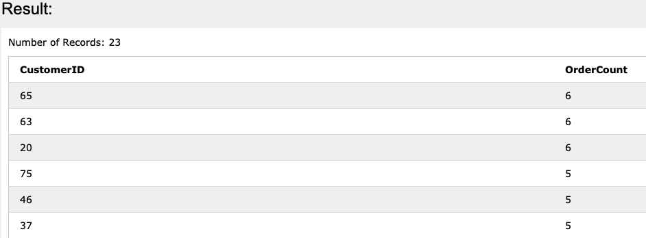

※もし仮に CustomerID にインデックスが貼っていた場合は、COUNT(\*)ではなく、COUNT(CustomerID)の方が処理速度が早くなるらしい。(カーディナリティなどデータの状況によりますが...)
参考：
http://mickindex.sakura.ne.jp/database/db_optimize.html#LocalLink-count

- 最もよく注文してくれたのは、どの Customer でしょうか？
  - CustomerID が`65,63,20`の Customer

参考：
https://qiita.com/TomK/items/132831ab45e2aba822a8

### 「一度の注文で、最大どれぐらいの注文詳細が紐づく可能性があるのか」調べる必要が生じました。過去最も多くの OrderDetail が紐づいた Order を取得してください。何個 OrderDetail が紐づいていたでしょうか？

実行したクエリは以下です。

```
SELECT OD.OrderID, MAX(OD.OrderDetailCount) AS MaxOrderDetailCount FROM
(SELECT OrderDetails.OrderID, COUNT (OrderDetails.OrderDetailID) AS OrderDetailCount FROM OrderDetails
INNER JOIN Orders ON Orders.OrderID = OrderDetails.OrderID
GROUP BY OrderDetails.OrderID) AS OD
```

以下でも書けました。分かりやすさは、こっちの方が良さそう。

```
SELECT OrderDetails.OrderID, COUNT(OrderDetails.OrderDetailID) AS OrderDetailCount FROM OrderDetails
INNER JOIN Orders ON Orders.OrderID = OrderDetails.OrderID
GROUP BY OrderDetails.OrderID
ORDER BY OrderDetailCount DESC
LIMIT 1;
```

実行結果

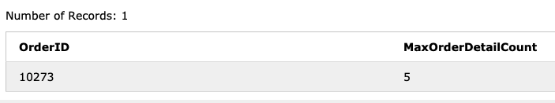

### 「一番お世話になっている運送会社を教えて欲しい」と頼まれました。過去最も多くの Order が紐づいた Shipper を特定してみてください

実行したクエリは以下です。

```
SELECT ShipperID, COUNT(OrderID) AS OrderCount FROM Orders
GROUP BY ShipperID
ORDER BY OrderCount DESC;
```

実行結果

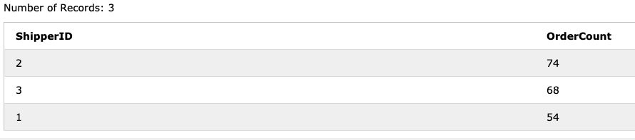

### 「重要な市場を把握したい」と頼まれました。売上が高い順番に Country を並べてみましょう

実行したクエリは以下です。

```
SELECT ROUND(SUM(PriceByOrders.TotalPriceByOrder)) AS Sales, Customers.Country FROM Orders
JOIN (
  SELECT SUM(OrderDetails.Quantity * Products.Price) AS TotalPriceByOrder, OrderDetails.OrderID FROM OrderDetails
  JOIN Products ON OrderDetails.ProductID = Products.ProductID
  GROUP BY OrderID
) PriceByOrders ON PriceByOrders.OrderID = Orders.OrderID
JOIN Customers ON Customers.CustomerID = Orders.CustomerID
GROUP BY Customers.Country
ORDER BY Sales DESC;
```

実行結果

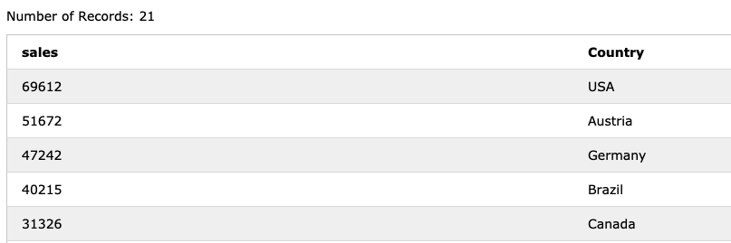

### 国ごとの売上を年毎に（1 月 1 日~12 月 31 日の間隔で）集計してください

実行したクエリは以下です。

```
SELECT ROUND(SUM(PriceByOrders.TotalPriceByOrder)) AS Sales, strftime('%Y', DATE(Orders.OrderDate)) AS OrderYear, Customers.Country FROM Orders
JOIN (
  SELECT SUM(OrderDetails.Quantity * Products.Price) AS TotalPriceByOrder, OrderDetails.OrderID FROM OrderDetails
  JOIN Products ON OrderDetails.ProductID = Products.ProductID
  GROUP BY OrderID
) PriceByOrders ON PriceByOrders.OrderID = Orders.OrderID
JOIN Customers ON Customers.CustomerID = Orders.CustomerID
GROUP BY Customers.Country, strftime('%Y', DATE(Orders.OrderDate))
ORDER BY Country;
```

実行結果


### 「社内の福利厚生の規定が変わったので、年齢が一定以下の社員には、それとわかるようにフラグを立てて欲しい」と頼まれました

- Employee テーブルに「Junior（若手）」カラム（boolean）を追加して、若手に分類される Employee レコードの場合は true にしてください

下記のクエリを実行して、Junior カラムを新たに追加しました。

```
ALTER TABLE Employees ADD COLUMN Junior boolean default false not null;
```

- Junior の定義：誕生日が 1960 年より後の Employee の場合は値を TRUE にする更新クエリを作成してください

下記のクエリを実行して、Junior カラムの値を更新しました。

```
UPDATE Employees
SET Junior = true
WHERE  strftime('%Y', DATE(BirthDate)) >= '1960';
```

実行結果

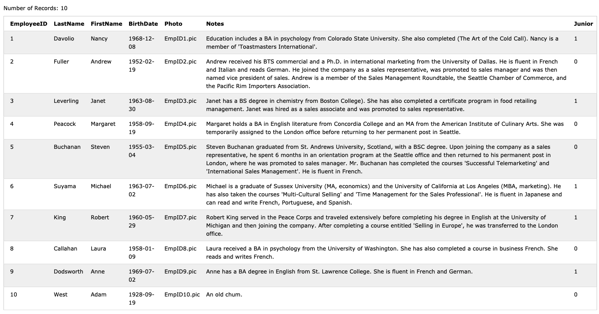

### 「長くお世話になった運送会社には運送コストを多く払うことになったので、たくさん運送をお願いしている業者を特定して欲しい」と頼まれました

- 「long_relation」カラム（boolean）を Shipper テーブルに追加してください

下記のクエリを実行して、long_relation カラムを新たに追加しました。

```
ALTER TABLE Shippers ADD COLUMN long_relation boolean default false not null;
```

- long_relation が true になるべき Shipper レコードを特定して、long_relation を true にしてください。long_relation の定義：これまでに 70 回以上、Order に関わった Shipper（つまり発注を受けて運搬作業を実施した運送会社）

下記のクエリを実行すると、ShipperID 別に Order の回数が分かります。(70 回以上は、ShipperID が 2 の運送会社)

```
SELECT *, COUNT(ShipperID) AS OrderCount FROM Orders
GROUP BY ShipperID
```

下記のクエリを実行して、long_relation カラムの値を更新しました。

```
UPDATE Shippers
SET long_relation = true
WHERE ShipperID IN  (
SELECT ShipperID FROM Orders
GROUP BY ShipperID
HAVING COUNT(ShipperID)  >= 70
);
```

実行結果

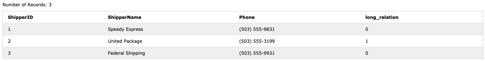

下記のようなクエリでも問題なさそうな気がしたが、`Shippers.ShipperID`でエラーが出てしまい断念...。

```
UPDATE Shippers
SET long_relation = true
FROM Shippers
INNER JOIN (
SELECT ShipperID, COUNT(ShipperID) AS OrderCount FROM Orders
GROUP BY ShipperID
HAVING OrderCount >= 70
) AS Orders
ON Orders.ShipperID = Shippers.ShipperID;
```

参考：
https://stackoverflow.com/questions/12225715/update-statement-using-join-and-group-by

### 「それぞれの Employee が最後に担当した Order と、その日付を取得してほしい」と頼まれました。OrderID, EmployeeID, 最も新しい OrderDate

実行したクエリは以下です。

```
SELECT EmployeeID, MAX(OrderDate) AS LatestOrderDate FROM Orders
GROUP BY EmployeeID;
```

実行結果

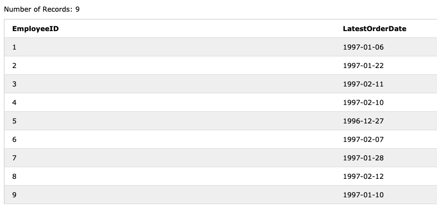

### NULL の扱いに慣れておきましょう！

- Customer テーブルで任意の１レコードの CustomerName を NULL にしてください

下記のクエリを実行して、`CustomerID`が 1 の CustomerName を null にしました。

```
UPDATE Customers
SET CustomerName = null
WHERE CustomerID = 1;
```

- CustomerName が存在するユーザを取得するクエリを作成してください

実行したクエリは以下です。

```
SELECT * FROM Customers
WHERE CustomerName IS NOT null;
```

実行結果

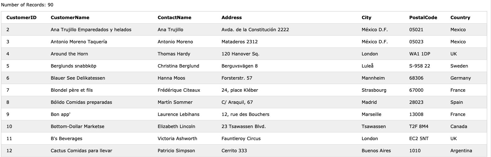

- CustomerName が存在しない（NULL の）ユーザを取得するクエリを変えてください

実行したクエリは以下です。

```
SELECT * FROM Customers
WHERE CustomerName IS null;
```

実行結果

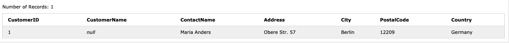

- もしかすると、CustomerName が存在しないユーザーを取得するクエリを、このように書いた方がいるかもしれません。SELECT \* FROM Customers WHERE CustomerName = NULL;しかし残念ながら、これでは期待した結果は得られません。なぜでしょうか？
  NULL は「データが全く存在しないこと」を示す概念のことであり、論理演算子では判別できないため、特別な構文を使う必要があります。

  参考：
  https://xtech.nikkei.com/it/article/COLUMN/20060302/231519/

### JOIN の違いに慣れておきましょう！

- EmployeeId=1 の従業員のレコードを、Employee テーブルから削除してください

下記のクエリを実行して、EmployeeId=1 のレコードを削除しました。

```
DELETE FROM Employees
WHERE EmployeeID = 1;
```

- Orders と Employees を JOIN して、注文と担当者を取得してください。その際：（削除された）EmloyeeId=1 が担当した Orders を表示しないクエリを書いてください

実行したクエリは以下です。

```
SELECT Orders.OrderID, Orders.CustomerID, Employees.EmployeeID, Orders.OrderDate, Orders.ShipperID FROM Orders
INNER JOIN Employees ON Employees.EmployeeID = Orders.EmployeeID;
```

実行結果

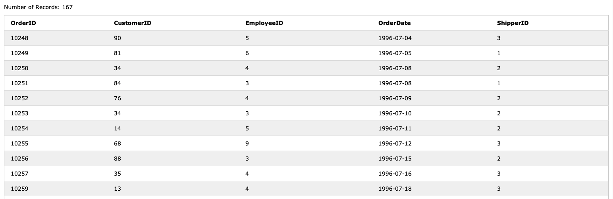

- （削除された）EmloyeeId=1 が担当した Orders を表示する（Employees に関する情報は NULL で埋まる）クエリを書いてください

実行したクエリは以下です。

```
SELECT Orders.OrderID, Orders.OrderID, Orders.CustomerID, Employees.EmployeeID, Orders.OrderDate, Orders.ShipperID FROM Orders
LEFT OUTER JOIN Employees ON Employees.EmployeeID = Orders.EmployeeID
WHERE Employees.EmployeeID IS null;
```

実行結果

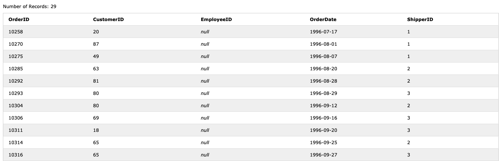

※ `Orders.EmployeeID`は 1 が入っているので、`Employees.EmployeeID`を使わないと null の値が取れない。

## 課題２（質問）

### GROUP BY した上で絞り込みを行う際「WHERE」と「HAVING」二つのクエリを使えますが、それぞれの違いを教えてください。どのような時にどちらを使うべきでしょうか？

[実行順序](https://qiita.com/yurina0402/items/78ae1f536b6755d6221a)がことなります。
「WHERE」は GROUP BY の前に実行する必要があり、「HAVING」は GROUP BY の後に実行する必要があります。

- where 句は「行(カラム単体)」に対する条件を指定すること。
- having 句は「グループ(GROUP BY や MAX などの集計関数を使用した値)」に対する条件をしていすること。

参考：
http://skyit.biz/2017/04/01/having%E5%8F%A5%E3%81%A8where%E5%8F%A5%E3%81%AE%E9%81%95%E3%81%84/

### SQL の文脈において DDL、DML、DCL、TCL とは何でしょうか？それぞれ説明してください

- DDL
  Data Definition Language(データ定義言語)と呼ばれ、データベース内の表、ビューやインデックスなどの各種オブジェクトの作成や変更を行うための SQL 文です。

参考：
https://enterprisezine.jp/article/detail/3521

- DML
  Data Manipulation Language(データ操作言語)と呼ばれ、`SELECT/INSERT/UPDATE/DELETE`などのテーブルに対する操作(データの取得・追加・更新・削除)を行う SQL 文です。

参考：
https://morizyun.github.io/database/sql-ddl-dml-dcl.html

- DCL
  Data Control Language(データ制御言語)と呼ばれ、`GRANT(アクセス権付)`や`REVOKE(権限破棄)`などのデータベースへのアクセス制御を行うための SQL 文です。

参考：
http://www.kogures.com/hitoshi/webtext/db-ddl-dml-dcl/index.html

- TCL
  Transaction Control Language(トランザクション制御言語)と呼ばれ、`BEGIN/COMMIT/ROLLBACK`などのトランザクションの制御を行うための SQL 文です。

参考：
https://gr8developer.blogspot.com/2017/12/ddldmldcltcl.html#chapter-3

## 課題３（クイズ）

no.1：データベースのカラムに設定出来る CHECK 制約とはどのような設定でしょうか？

<details><summary>回答</summary>
CHECK制約は不等号やAND/ORを使って、カラムに格納できる値を限定できる機能です。
例えば、`persons`テーブルに血液型カラムを追加したい時は以下のように書くことで、'A','B','O','AB'以外のデータが登録出来なくなります。
```
ALTER TABLE persons ADD blood_type TEXT NOT NULL check(blood_type = 'A' or blood_type = 'B' or blood_type = 'O' or blood_type = 'AB')
```

参考：
https://www.ritolab.com/entry/197#aj_1

</details>

no.2：[w3schools](https://www.w3schools.com/sql/trysql.asp?filename=trysql_select_all)を用いて、`Orders`テーブルの`OrderDate`が新しい順で 20 番目から 10 件のデータを取得するクエリを教えてください。

実行結果

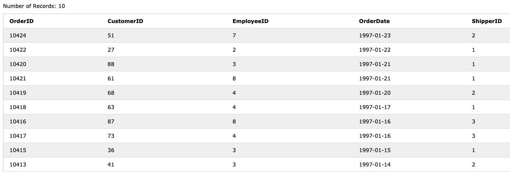

<details><summary>回答</summary>
```
SELECT * FROM Orders
ORDER BY OrderDate DESC
LIMIT 10
OFFSET 20;
```
</details>

no.3：[w3schools](https://www.w3schools.com/sql/trysql.asp?filename=trysql_select_all)を用いて、`Products`テーブルの`ProductName`に`Queso`が含まれるデータを取得するクエリを教えてください。

実行結果

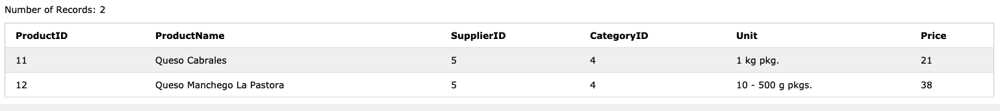

<details><summary>回答</summary>
```
SELECT * FROM Products
WHERE ProductName LIKE '%Queso%';
```
</details>
