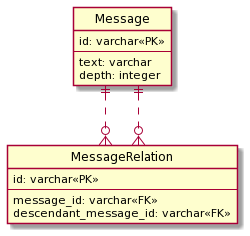
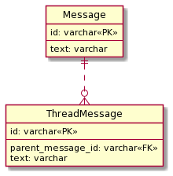

## 課題１

**ナイーブツリー(SQL アンチパターンより)**
**問題**

- 階層の深さが決まっていないため、スレッド内の message を全件取得しようとすると SQL が複雑化する。(再帰クエリが必要)
- ある Message 配下の Message 数を取得したい時に集約クエリを用いて手軽に取得することが難しくなる。
- 削除が難しい。中間の階層のレコードを削除しようとした場合、外部キーである`parent_message_id`の整合性を担保するために、一番したの階層のレコードから順番に削除する必要がある。

**解決したい課題**

今回は、Slack のようなアプリでメッセージ機能を作りたい場合を仮定して、以下のような解決したい課題を考えました。

- Message の階層は制限無く作りたい。
- Message がどの階層なのか知りたい。(一番トップの Message を表示して、それ以外はスレッドに表示したい)
- Message のスレッド数を出したい。
- Message の追加・削除をシンプルに行いたい。

## 課題２

SQL アンチパターンで解説されている 3 つの解決策(「経路列挙」「入れ子集合」「閉包テーブル」)より、自分は閉包テーブルをベースにし
た設計を行いました。

**経路列挙**

- メリット

  - 経路の追加・削除が比較的楽に行える。
    - (追加)経路を格納しているカラムに「親レコードの経路」/「親レコードの id」を追加するだけで良い。
    - (削除)削除するレコードと「削除するレコードの経路」/「削除するレコードの id」を経路に含むレコードを検索して削除するだけで良い。前方一致で検索することで、検索時にインデックスを活用することが出来る。
  - レコードを見ただけで階層構造が分かるので、他のエンジニアが見て混乱しない。
  - 階層数も経路から算出することが出来る。

- デメリット

  - 参照整合性を保証出来ない。
    - 不正なデータが入る恐れがある。
  - 経路は文字列で登録しているので、文字列型のデータが登録出来る長さ分の階層しか作ることが出来ない。
  - 階層構造を変更する際の処理が複雑になる。
    - 別の階層に移動させる際、移動させるレコードの全ての経路を更新する必要があり、経路列挙の場合は経路を再計算する必要がある。(例: '1/3', '1/3/4'の二つのレコードを 1 -> 2 に移動した場合、それぞれ経路は'2/3', '2/3/4'に変更する必要があるため、アプリケーション側で処理を入れる必要がある。)

**入れ子集合**

- メリット

  - 特定の階層以下のレコードを取得する処理をシンプルに書くことが出来る。(BETWEEN を使って、範囲を選択するだけで済む)

- デメリット

  - 参照整合性を保証出来ない。
  - 仕様が複雑化する。
    - 深さ先探索について理解しておく必要がある。
  - レコードを追加・削除する処理を行う際に幅の再計算が必要になるため、複雑化する。
  - 階層構造のルートのレコードを取得するクエリが複雑化する。
  - ルートのレコードだけを取得する処理が複雑化する。

**閉包テーブル**

- メリット

  - 参照整合性を担保することが出来る。
  - 階層の深さを制限することなくレコードを作成することが出来る。
  - レコードの追加・削除をシンプルに行うことが出来る。

- デメリット

  - 階層構造管理用のテーブルを別途作成する必要がある。
  - 学習コストが少し掛かる。(閉包テーブルについて理解しておく必要がある。)
  - 階層構造を保持するテーブルのレコードが多くなる。
  - 何階層目のレコードなのかが分からない。(階層の深さを保存するカラムを用意することで解決出来ます。)

以上より、今回は閉包テーブルをベースにした設計を行いました。
こちらの[記事](https://medium.com/mixi-developers/tree-structure-in-rdb-4ba3f36d8565)を参考にしました。

Message テーブルとその Message

```sql
TABLE Message {
  id: varchar
  text: varchar
  depth: integer
}

TABLE MessageRelation {
  id: varchar
  message_id: varchar<<FK>>
  descendant_message_id: varchar<<FK>>
  FOREIGN KEY (parent_message_id) REFERENCES Message(id)
  FOREIGN KEY (parent_message_id) REFERENCES Message(id)
}
```

それぞれのテーブルのリレーションは以下です。

Message ： MessageRelation(message_id) = 1 : 0 or 多

Message ： MessageRelation(descendantmessage_id) = 1 : 0 or 多

※ Relation の線に対して注釈を付ける方法がなかったので、線だけ引いてあります。


- 閉包テーブルとの違い
  - MessageRelation テーブルの`message_id`,`descendant_message_id`それぞれに自身の message.id を保存したレコートを作成しないようにしている。(例: message.id = 1 のレコード作成時に、message_id = 1, descendant_message_id = 1 のレコードを作成しない)
    - このレコードを作成する理由が分からなかったため、作りませんでした。message の削除・階層の変更を行う際に余計な処理が増えるので、要らないと判断しました。
  - Message テーブルに depth カラムを含めた。
    - 階層の深さを知るために追加しました。

今回の設計によって、解決したい課題に対して問題なく対応出来るようになりました。

- Message の階層は制限無く作りたい。
  - 制限なく作れる。
- Message がどの階層なのか知りたい。(一番トップの Message を表示して、それ以外はスレッドに表示したい)
  - depth によって、階層の深さが分かる。トップ階層の Message は depth = 0 のレコードを取得する。
- Message のスレッド数を出したい。
  - トップ階層の Message を取得し、MessageRelation テーブの message_id に取得した message.id を含むレコード数を数えればスレッド数が出せる。
- Message の追加・削除をシンプルに行いたい。
  - MessageRelation・Message テーブルに対して、追加・削除処理を行う必要があるが、ロジックとしては、比較的シンプルに行うことが出来る。

### 別解

今回 Slack のようなメッセージ機能を作る場合、メッセージの階層は 1 つしか作れないので、親のメッセージだけを分けて保持する設計にした方がメンテナンス性と速度面を考えても良さそうな気がしました。(※今回は、解決したい課題に「階層を制限なく作りたい」という要件を入れていたため、その場合は使えません。)

具体的には以下のような設計

```sql
TABLE Message {
  id: varchar
  text: varchar
}

TABLE ThreadMessage {
  id: varchar
  parent_message_id: varchar
  text: varchar
  FOREIGN KEY (parent_message_id) REFERENCES Message(id)
}
```

テーブルのリレーションは以下です。

Message ： ThreadMessage = 1 : 0 or 多



### メモ

- 今回の例では、階層の深さに拡張性を持たせたいという点から、今回の設計だと問題が生じると判断しましたが、深さがある程度分かっており、入れ替えが殆どないような場合は今回の設計を選択しても問題ないように感じました。(例: ブログに付ける階層関係があるカテゴリーなど)

- 入れ子集合を用いた設計を使うことはあるのだろうか？
- 閉包テーブルの階層構造を保持するテーブルの先祖・子孫カラムに同一 id を格納したレコードを保存する意味はなんだろう？
