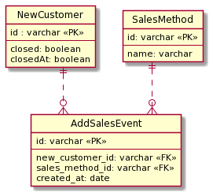

## 課題１

**メタデータトリブルとマルチカラムアトリビュート？(SQL アンチパターンより)**

**問題**

- 営業の方法が増える度にカラムが増えてしまう。
  - 例えば、テレカンが増えた場合、`teleconference`カラムを新たに追加する必要がある。
  - アポを 2 回行った場合、カラムを新たに増やさないとデータを保存することが出来ない。
- それぞれ個別の営業イベントがいつ行われたのかが分からなく、常に最新の情報しか分からない。
  - 〜月に電話をした件数が知りたい時にデータを取得することが出来ない。
- 面談出来なかった or 成約しなかった場合に null が存在してしまう。
- 仮にそれぞれの営業イベントでお客さんの熱量を(1~5 段階で)保存したいとなった場合、それぞれカラムを増やすことになってしまう。

## 課題２

顧客(NewCustomer)と営業方法(SalesMethod)テーブルを作成し、それぞれのイベントを保存する(AddSalesEvent)テーブルを作ることにした。
AddSalesEvent テーブルの created_at カラムはイベントが発生した日時を保存するために追加した。

```sql
TABLE NewCustomer {
  id: varchar <<PK>>
  closed: boolean -- 成約した
  closedAt: boolean -- 成約した日付が入る
}

TABLE AddSalesEvent {
  id: varchar <<PK>>
  new_customer_id: varchar <<FK>>
  sales_method_id: varchar <<FK>>
  created_at: date
}

TABLE SalesMethod {
  id: varchar
  name: varchar -- telephone, metなどの値が入る
}
```

それぞれのテーブルのリレーションは以下です。

NewCustomer ： AddSalesEvent = 1 : 0 or 多

SalesMethod ： AddSalesEvent = 1 : 0 or 多



- 営業の方法が増える度にカラムが増えてしまう。
  - SalesMethod テーブルにレコードを発行することで対応することが可能。
- それぞれ個別の営業イベントがいつ行われたのかが分からなく、常に最新の情報しか分からない。
  - AddSalesEvent テーブルから確認したい SalesMethod の id と created_at を用いて検索することで、対応可能。
- 面談出来なかった or 成約しなかった場合に null が存在してしまう。
  - 面談は SalesMethod テーブルのレコードとして保持されるので、イベントが起こった時のみ SalesMethod テーブルにレコードが発行されるようになるため、null は作られない。
  - 成約(closed)は営業方法ではないので、NewCustomer テーブルに残した。成約した顧客一覧がみたいというユースケースが考えられたので、検索がしやすいように残した。
- 仮にそれぞれの営業イベントでお客さんの熱量を(1~5 段階で)保存したいとなった場合、それぞれカラムを増やすことになってしまう。
  - AddSalesEvent テーブルに status カラムを新たに追加することで対応可能。

**従属テーブルではなく、交差テーブルを用いた理由**

- SalesMethod テーブルに保存するデータをマスターデータとして、telephone などの営業手法を共通化することで、使い回すことが出来る。
- アポを複数回登録したい時、met1,met2 などのデータを作る必要がなくなる。

### メモ

- 今回の交差テーブルでマスターデータを持つことはありか？
  - 例えば、電話をかけた顧客に対してメールを送りたいとなった場合、SalesMethod の telephone のデータが保存されているカラムの id をアプリケーション側でハードコーディングする実装になりそう。
    - "telephone"で文字列検索するのもイマイチな気がした。
    - マスターデータを開発側で管理する体勢なら、slug などのカラムを持たせて slug = 0 は telephone などと判断するようにしても良いかも...？
