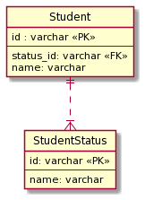

## 課題１

**サーティーワンフレーバー(SQL アンチパターンより)**

**問題**

- status にどんな値が入れられるのかが、テーブルの定義を見ないと分からない。
- status が減ったり、変更があった際の対応が難しい。
  - 既存のデータはどう扱うのか対応する必要がある。
- アプリケーションと DB それぞれで制約ルールを管理した時に、ルールの乖離が生じる恐れがある。
  - 大抵、アプリケーション側でバリデーションを設定する選択を行うことが多いため。

## 課題２

StudentStatus テーブルを作成することにした。

```sql
TABLE Student {
  id: varchar <<PK>>
  status_id: varchar<<FK>>
  name: varchar
}

TABLE StudentStatus {
  id: varchar <<PK>>
  name: varchar  -- studying, graduated, suspendedのような値が入る
}
```

それぞれのテーブルのリレーションは以下です。

Student ： StudentStatus = 1 : 多



- status にどんな値が入れられるのかが、テーブルの定義を見ないと分からない。
  - StudantStatus テーブルを確認することで、対応可能。
- status が減ったり、変更があった際の対応が難しい。
  - アプリケーションで制約を管理し、DB 側では柔軟にレコードで管理することが出来るようになった。
- アプリケーションと DB それぞれで制約ルールを管理した時に、ルールの乖離が生じる恐れがある。
  - アプリケーション側でドメインを管理することが出来るようになった。

**StudentStatus の期間を保持したい場合**

- Student と StudentStatus の交差テーブルを用いて、期間のカラムをいれることで対応する。
- 現在の status を取得する検索のクエリが辛い場合は、CurrentStudantStatus テーブルを作ることで対応出来そう。

### メモ

- SQL アンチパターンでは、status を外部キーに用いていたが、意味のあるデータを外部キーに使用するのはよくない気がした。
- 例えば、同時にリクエストが来た場合、アプリケーション側でバリデーションしていたことによって、不正なデータが作られてしまうという可能性は考慮した方がいいのか？
- SQL アンチパターンでは、文字列検索で status を行っていたが、日本語のデータを登録していた場合でも同じように行うのか？それとも、別で英字を保存しておく方がいい？
