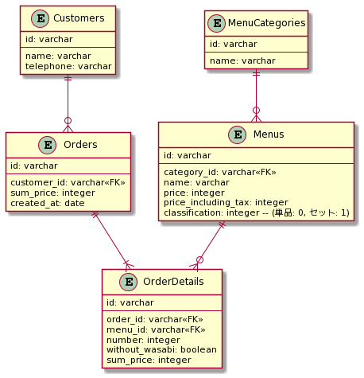
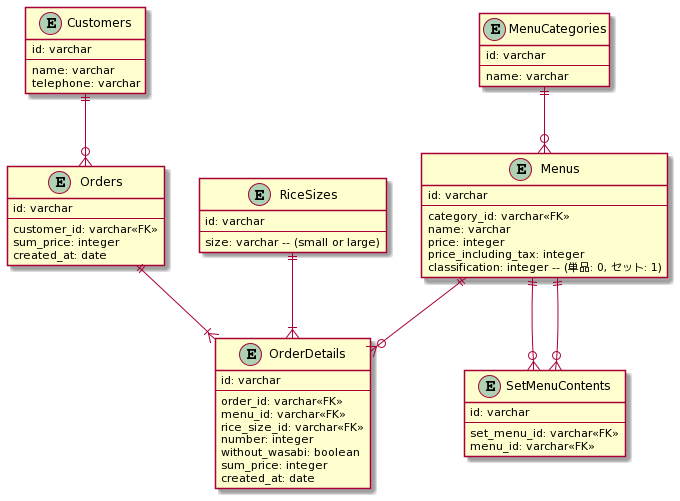
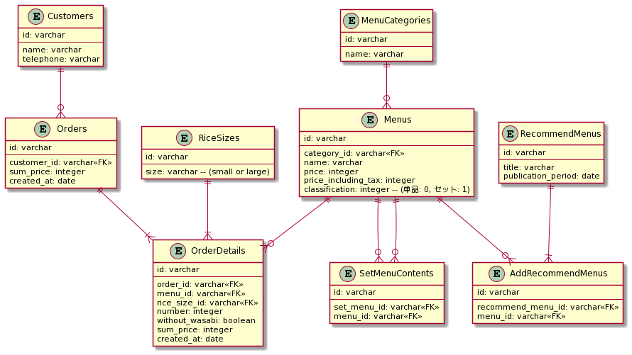

## 課題１

今回、書籍楽々 ERD レッスンを参考に設計を行いました。

設計の順序は以下です。

1.イベント系エンティティの抽出

2.リソース系エンティティの抽出

3.各エンティティに必要な項目を追加

4.各エンティティのリレーション関係を設定

5.ユースケースに応じて、テーブルやカラムを追加

**1.イベント系エンティティの抽出**

- システムは何かしらの行為を行うものなので、イベントから考えた方がシステムの目的が深まりやすく、また、リソース系のエンティティよりも比較的情報が得やすいため、取っ掛かりやすい。

今回の例だと、イベントは「Orders(注文)」になる。

**2.リソース系エンティティの抽出**

- 1.で見つけた「Orders(注文)」に対して、「誰が」「何を」という観点で考えると、「Customers(顧客)」「Menus(メニュー)」というエンティティが見つかる。

※ 〜すると、読み替えて違和感が感じるものはリソース系エンティティになる。(例: 顧客する、商品するは文章としておかしいので、リソースになる。)

**3.各エンティティに必要な項目を追加**

各エンティティに必要な項目を追加する。
無理に正規化せず、一旦素直に項目を入れていく。
「盛り込み」や「にぎり」などのカテゴリーを保持するための MenuCategories テーブルを新たに追加した。

- Customers

  - name(名前)
  - telephone(電話番号)

- Orders

  - number(注文数)
  - without_wasabi(サビ抜き)

- Menus

  - name(メニュー名)
  - price(金額)
  - price_including_tax(税込み金額)
  - classification(区分 セットなのか単品なのか)

- MenuCategories

  - name(カテゴリー名)

**4.各エンティティのリレーション関係を設定と 5.ユースケースに応じて、テーブルやカラムを追加**

ER 図を作った方がわかりやすいので、4. 5.を同時にやることにしました

- 各テーブルに識別子を加えてリレーションを作る。

- ユースケースを考える
  - メニュー一覧を表示する
    - セット or 単品
      - カテゴリー別(盛り込み or にぎり) or 金額別に表示する
  - 注文が出来る
    - 個数 and サビの有無
  - 注文の詳細が見れる
    - 合計 or 個別
  - 合計の皿数が見れる

以下が最終的なテーブル定義です。

```sql
TABLE Customers {
  id: varchar
  name: varchar
  telephone: varchar
}

TABLE Orders {
  id: varchar
  customer_id: varchar<<FK>>
  sum_price: integer
  created_at: date
}

TABLE OrderDetails {
  id: varchar
  order_id: varchar<<FK>>
  menu_id: varchar<<FK>>
  number: integer
  without_wasabi: boolean
  sum_price: integer
}

TABLE Menus {
  id: varchar
  category_id: varchar<<FK>>
  name: varchar
  price: integer
  price_including_tax: integer
  classification: integer -- (単品: 0, セット: 1)
}

TABLE MenuCategories {
  id: varchar
  name: varchar
}

```

作成した ER 図はこちらです。



- 設計のポイント
  - 注文とその詳細のテーブルを分けることで、その時の注文の合計を取得しやすくした
  - サビ抜きは、有無以外のパターンが見つからなかったので boolean のカラムで表現した
  - 単品かセットはカラムに integer で表現しているが、項目が増えたらテーブルを切り出しても良いかも？
  - menus に対する category も多対多の関係にしても良さそう？(ひとつしか付いてなかったので、今回は 1 対多で対応した)

## 課題２

- シャリの大小も選べる・セットとは別に寿司ネタが毎月何個売れているのか知る必要が生じました。どのようにテーブル設計をするべきでしょうか?

新たに以下のようなテーブルを追加した。
また、OrderDetails テーブルに created_at カラム(date 型)を新たに追加した。

```sql
TABLE RiceSizes {
  id: varchar
  size: varchar -- (small or large)
}

TABLE SetMenuContents {
  id: varchar
  set_menu_id: varchar<<FK>>
  menu_id: varchar<<FK>>
  FOREIGN KEY (set_menu_id) REFERENCES Message(id)
  FOREIGN KEY (menu_id) REFERENCES Message(id)
}

```

作成した ER 図はこちらです。



- 設計のポイント
  - シャリのサイズが大小だけではなく、中などもある可能性を考えたので、テーブルを分けた
  - SetMenuContents テーブルは Menus テーブルの中間テーブルで、セットメニューの時に組み合わせのメニューを保存するためのテーブルにした
    - OrderDetails と Menus を JOIN して、SetMenuContents と JOIN することで、寿司ネタが何個売れているのかが分かるようになる
    - Menu とネタをテーブルを分けて紐付ける実装も考えたが、今回の仕様が寿司ネタだけだったので、既存の寿司ネタが分かれば良いと判断した設計を行った

セットメニューの設計については、以下の記事を参考にしました。

https://suneo3476.hateblo.jp/entry/2013/04/03/233738

## 課題３

- 既存のメニューの中から、毎月おすすめのメニュー一覧を選んで表示することになりました。どのような DB 設計を行うとよいでしょうか？

**回答**

自分は以下のようにテーブルを新たに作った

```sql
TABLE RecommendMenus {
  id: varchar
  title: varchar
  publication_period: date(掲載期間)
}

TABLE AddRecommendMenus {
  id: varchar
  recommend_menu_id: varchar<<FK>>
  menu_id: varchar<<FK>>
}
```



- MenuCategories に「おすすめ」を追加して対応せずに、RecommendMenus とテーブルを分けて、掲載期間カラムを追加することで毎月おすすめメニューを登録しやすくした
  - カテゴリーにした場合、期間の設定が出来ず、手動で毎回作業する必要が出てしまう
- RecommendMenus には title を追加して、おすすめメニューのテーマを入れられるようにした
- 懸念点: メニュー一覧におすすめのメニューも一緒に表示して欲しいという要望が出たら、少しクエリが複雑になる

## メモ

- ユースケースに応じて、カラムを追加するのは論理設計 or 物理設計？
- マクドナルドとかのメニューとか設計してみると面白そう。
