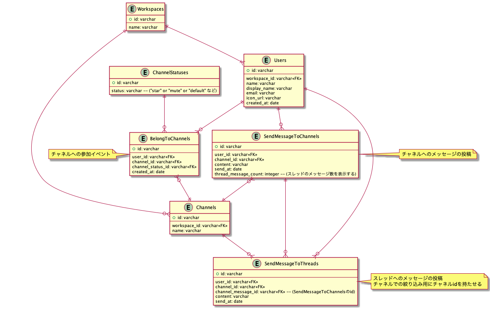

## 課題１

1. イベント系エンティティの抽出

「チャネルにメッセージを送信する(SendMessageToChannels)」、「スレッドにメッセージを送信する(SendMessageToThreads)」、「ワークスペースに参加する(JoinWorkspaces)」、「ワークスペースから脱退する(LeaveWorkspaces)」、「チャネルに参加する(JoinChannels)」、「チャネルから脱退する(LeaveChannels)」

※ 行動をしたことによって、状態が変化する(データが作成される)ことをイメージすると良さそう。「メッセージを検索する」もイベントのひとつだが、状態が変化しないので、イベント系エンティティとしては抽出しない(ユースケースのタイミングでは考慮する)。

2. リソース系エンティティの抽出

「ユーザー(Users)」、「ワークスペース(Workspaces)」、「チャネル(Channels)」

3. 各エンティティに必要な項目を追加

- SendMessageToChannels

  - content(メッセージ内容)
  - send_at(メッセージが送信された日時)

- SendMessageToThreads

  - content(メッセージ内容)
  - send_at(メッセージが送信された日時)

- JoinWorkspaces

  - created_at(参加日時)

- LeaveWorkspaces

  - created_at(脱退日時)

- JoinChannels

  - created_at(参加日時)

- LeaveChannels

  - created_at(脱退日時)

- Users

  - name(ユーザー名)
  - display_name(メンションやメッセージ一覧で表示する)
  - email
  - icon_url(一旦、アイコンの URL だけ)

- Workspaces

  - name(ワークスペース名)
  - subdomain_name(slack の url で使用する)

- Channels

  - name(チャネル名)

4. 各エンティティのリレーション関係を設定
5. ユースケースに応じて、テーブルやカラムを追加

**4・5 は一緒にやる**

- ユースケースを考える

  - メッセージ
    - メッセージを送信する
    - チャネル(team-1 or pair-1a)にメッセージ一覧を表示する
    - スレッドメッセージの数を表示する
  - スレッドメッセージ
    - メッセージに対して、スレッドメッセージを送信する
    - スレッドメッセージ一覧を表示する
  - チャネル
    - チャネルに参加する
    - private or public
    - チャンネルのお気に入り(star)
    - チャネルをミュートする
  - ワークスペース
    - ワークスペースに参加する
    - ユーザーとワークスペースは 1 : 1
      - ログインする度に email を使ってアカウントを発行する
  - 横断機能
    - メッセージとスレッドを横断的に検索する
    - チャネルで絞り込みが出来る
    - ユーザーで絞り込みが出来る

- 今回、ユーザーに対してワークスペースが一つしかないこととチャネルとワークスペースの脱退した時の履歴を持たせる必要がなさそうだったので、「JoinWorkspaces」、「LeaveWorkspaces」、「LeaveChannels」は使用しないことにしました。

以下、テーブル定義書です。

```sql
TABLE SendMessageToChannels {
  id: varchar
  user_id: varchar<<FK>>
  channel_id: varchar<<FK>>
  content: varchar
  send_at: date
  thread_message_count: integer -- (スレッドのメッセージ数を表示する)
}

TABLE SendMessageToThreads {
  id: varchar
  user_id: varchar<<FK>>
  channel_id: varchar<<FK>>
  channel_message_id: varchar<<FK>> -- (SendMessageToChannelsのid)
  content: varchar
  send_at: date
}

TABLE Channels {
  id: varchar
  name: varchar
}

TABLE JoinChannels {
  id: varchar
  user_id: varchar<<FK>>
  channel_id: varchar<<FK>>
  channel_status_id: varchar<<FK>>
  created_at: date
}

TABLE ChannelStatuses {
  id: varchar
  status: varchar -- (star or muteなど)
}

TABLE Workspaces {
  id: varchar
  name: varchar
}

TABLE Users {
  id: varchar
  workspace_id: varchar<<FK>>
  name: varchar
  display_name: varchar
  email: varchar
  icon_url: varchar
}
```

作成した ER 図はこちらです。



### 設計のポイント

- slack はワークスペース毎にユーザーを作成しているので、その設計に合わせた。
  - Users の created_at = ワークスペースに参加した日
- SendMessageToChannels に thread_message_count(スレッドメッセージ数)を持たせることで、メッセージ一覧を表示する度にスレッドメッセージ数をいちいち計算しないようにしている。(キャッシュ的な)
- ユーザーとメッセージ or スレッドメッセージはそれぞれ 1 : 多にした。
  - メッセージの内容を共有することがないので、中間テーブルは作らなかった。
- メッセージとスレッドメッセージのテーブルを分けた。
  - 今回の仕様では階層は 2 階層までしか存在しないことと、チャネル一覧では 1 階層目のメッセージしか表示しないこと、メッセージテーブルは肥大化する可能性が大きのでユースケースによって不要になるデータを検索対象に含めたくなかった。
  - 横断検索は最悪 ElasticSearch などに投げれば対応出来そう？だが、スレッドメッセージを分ける作業は辛そう...。
  - メッセージの横断検索はどうするの？
    - JoinChannels からユーザーが所属しているチャネルの id を取り出して、SendMessageToChannels と SendMessageToThreads にそれぞれクエリを投げる。
    - send_at 順に並び替えて表示したい場合は UNION して order by send_at すれば対応出来そう。

### 考えても良いかも系の仕様

- チャネルを作る
- チャネルの並び順
- チャネルにトピックを付ける
- メッセージの共有リンクを発行
- メッセージをピン留めする
- メッセージにメディアファイルを付けて投稿する
- ワークスペースを作る
  - 作成した際に自動的にユーザーが発行される
- ワークスペース一覧を表示する
  - ログインしているユーザーはそれぞれ変わっている(アプリのみ)
  - 何らかの識別子を用いて統合させていそう
- DM 機能
- DM を含めてメッセージを検索する

### メモ

- イベント系で作成する日時カラムは created_at(イベントの作成日)というニュアンスでカラムを作るのと、send_at(送信日)・joined_at(参加日時)などのイベントの意味合いに近いカラムを作るのと、どちらがいいのだろう？

- 「メッセージ(Messages)」、「スレッドメッセージ(ThreadMessages)」もリソーステーブルとして考えられそう？な気がしたが、内容を共有することが無かったので作らなかった。

  - 多 : 多でイベントを意識することがあるという話があったので、1 : 多 の関係でイベントテーブルを作るのは問題ないのか？もしくは Users : Messages = 1 : 多で対応した方がよいのか？

- イベント系のテーブルは誰が？のプレフィックスを付けた方がいい？例: UserJoinChannels

- RDB を用いた検索クエリはどのパターンを選ぶべきか？

  - Messages テーブル内で階層構造を作って、テーブル単体で検索する
    - 検索時のクエリは楽になりそうだが、Messages はレコード量がかなり多くなるので、既存の機能(メッセージ一覧の表示など)がボトルネックになってしまいそう。
  - Messages テーブルと ThreadMessages テーブルに分けて、それぞれにクエリを発行する(今回のパターン)
    - クエリを 2 回発行することになってしまうが、問題ないか？
      - データ量が多い中の検索時間 or クエリを複数回実行することの I/O 待ち時間のどちらを普段は意識するべきなんだろう？
  - Messages テーブルと ThreadMessages テーブルを UNION して検索する
    - パフォーマンスが心配？

- 今回、SendMessageToChannels に thread_message_count カラムを持たせたが、メッセージを編集している時にスレッドにメッセージを投稿するというユースケースは考えられるので、容易にデッドロックの可能性が考えられる。

  - thread_message_count の更新が即時反映じゃなくても良いなら非同期処理に投げる？

- 脱退テーブルを作る必要があるユースケース

  - 参加したことがあるチャネル一覧を表示するとか？

- 今回の要件で一番レコードが増えそうな Messages のデータ量は具体的にどんな観点で考えた方がいいのだろうか？

  - 例えば、半年で会社の目標導入社数をベースに考える？その中で、会社規模の比率がどれくらいで、そこから 1 日のメッセージ数を出す？

- 課題とは別だが、メッセージとか記事の編集を行う時の履歴保持はどうするべき？
  - Ajax で定期的に update する
    - 差分更新
    - 通信回数が多い
  - インメモリにデータを保持しておき、どこかのタイミングで更新処理をかける
    - データが失われる可能性がある
