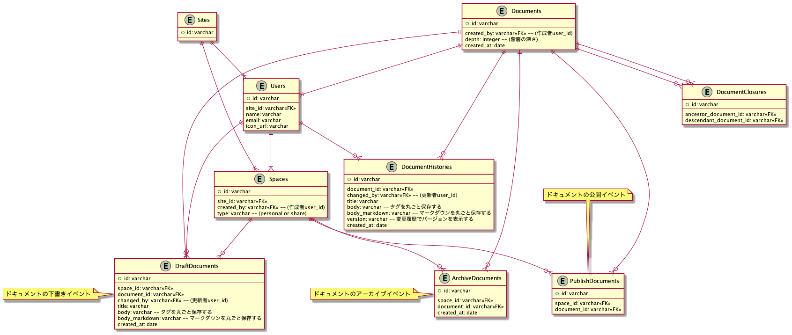

## 課題 1

**前提: Confluence をイメージしたアプリケーションをモデリングする**

1. イベント系エンティティの抽出

「ドキュメントを公開する(PublishDocuments)」「ドキュメントを非公開にする(ArchivedDocuments)」

以下は今回イベントとして捕らえなかった

- 「ドキュメントを削除する」
- 「ドキュメントを指定の場所に移動する」

2. リソース系エンティティの抽出

「ユーザー(Users)」「ドキュメント(Documents)」」「ドキュメントの階層を保存(DocumentClosures)」「スペース(Spaces)」

3. 各エンティティに必要な項目を追加

- PublishDocuments

  - created_at(公開日時)

- ArchiveDocuments

  - created_at(非公開日時)

- Users

  - name(ユーザー名)
  - email
  - icon_url

- Documents

  - title
  - body(タグを丸ごと保存する)
  - body_markdown(マークダウンを丸ごと保存する)
  - created_at(作成日時)

- Spaces

  - name
  - type(個人 or 共有)

4. 各エンティティのリレーション関係を設定
5. ユースケースに応じて、テーブルやカラムを追加

**4・5 は一緒にやる**

- ユースケースを考える

  - ドキュメント
    - ドキュメントを公開する
      - スペースから表示しているドキュメントまでのパスを表示する
    - ドキュメントを非公開(アーカイブ)にする
    - ドキュメントを削除する
    - ドキュメントを下書きにする
    - ドキュメントの作成者・更新者を表示する
    - 変更履歴を管理出来る(公開されているドキュメントのみ)
    - 最近作業したドキュメント一覧を表示する
    - 下書きのドキュメント一覧を表示する
  - ユーザー
    - スペースを作る(共有 or 個人)
  - スペース
    - スペース配下にドキュメントを作る

以下、テーブル定義書です。

```sql
TABLE PublishDocuments {
  id: varchar
  space_id: varchar<<FK>>
  document_id: varchar<<FK>>
}

TABLE ArchiveDocuments {
  id: varchar
  space_id: varchar<<FK>>
  document_id: varchar<<FK>>
  created_at: date
}

TABLE DraftDocuments {
  id: varchar
  space_id: varchar<<FK>>
  document_id: varchar<<FK>>
  changed_by: varchar<<FK>> -- (更新者user_id)
  title: varchar
  body: varchar -- タグを丸ごと保存する
  body_markdown: varchar -- マークダウンを丸ごと保存する
  created_at: date
}

TABLE Users {
  id: varchar
  site_id: varchar<<FK>>
  name: varchar
  email: varchar
  icon_url: varchar
}

TABLE DocumentClosures {
  id: varchar
  ancestor_document_id: varchar<<FK>>
  descendant_document_id: varchar<<FK>>
}

TABLE Documents {
  id: varchar
  created_by: varchar<<FK>> -- (作成者user_id)
  depth: integer -- (階層の深さ)
  created_at: date
}

TABLE DocumentHistories {
  id: varchar
  document_id: varchar<<FK>> -- (更新者user_id)
  changed_by: varchar<<FK>> -- (更新者user_id)
  title: varchar
  body: varchar -- タグを丸ごと保存する
  body_markdown: varchar -- マークダウンを丸ごと保存する
  version: varchar -- 変更履歴でバージョンを表示する
  created_at: date
}

TABLE Spaces {
  id: varchar
  site_id: varchar<<FK>>
  created_by: varchar<<FK>> -- (作成者user_id)
  type: varchar -- (personal or share)
}

TABLE Site {
  id: varchar
}

```

作成した ER 図はこちらです。



### 工夫した点

- PublishDocuments テーブルは公開されている記事だけのデータを持つ
  - スペースの記事一覧を取る時は、PublishDocuments の space_id に紐づく Documents を取得するだけで良い
  - アーカイブされたドキュメントは ArchiveDocuments をみないと取得出来ないようになっている
- ドキュメントの作成者と更新者のデータを持たせたかったので、Documents と DocumentHistories にそれぞれ user_id が紐づけた
  - 基本的には作成者は不変
    - ユーザーが削除されたらどうするか、仕様を考える
- ドキュメントの body を DocumentsHistories に持たせた(交差エンティティの履歴をイメージして作った)
  - ドキュメントは階層構造を持つので、ドキュメントを更新する度に id を変えたくなかった
  - ドキュメントを移動させた時は履歴に残す必要がなかったので、depth(深さ)は Documents に持たせた
- 下書きを表現したくて DraftDocuments を作ったが、もっと良い方法がなかったのか？
  - 公開済みのドキュメントの下書きなのか判断するカラムを追加する必要がありそう？

※ ペアレビューで depth は Documents テーブルではなく、DocumentClousures テーブルに持たせた方が良いのでは？と指摘があった

- SQL のクエリでソートしたい場合には、DocumentClousures テーブルに持たせる方法はありかもしれないと思った
- DocumentClousures テーブルに深さを持たせた場合、各階層からの深さを保存する必要がある(例: 1 - 2 の深さは 1・2 - 3 の深さは 1)
  - 自分はトップレベルからの深さだけを考えれば良いと思ったので、Documents テーブルに深さを保存することにした
    - こちらの方が深さの差分を計算するのが、常にトップレベルに対する値になるので考えることが減らせそう
    - 逆に、あるドキュメントからの深さを知りたいとなったとしても、深さの差分をアプリケーション上で計算すれば出せる

### 考えても良いかも系の仕様

- ドキュメントにいいねをする
- ドキュメントにスターを付ける
- ドキュメントにコメントする
- ドキュメントに公開範囲を設定する
- 最近表示したドキュメント一覧を表示する
- チームを作る

### メモ

- 記事のデータをどのように持つべきか(pros, cons)

  - Notion のようにそれぞれをブロックとして保持する
    - pros
      - セキュリティをチェックしやすい
      - 独自の WebComponent を作れるなど自由度が広がる
      - 差分更新しやすい
      - 差分チェックが出来るかも？
    - cons
      - レコード数が多くなる
      - 各ブロックの順番を保持する必要がある
  - Confluence, note, zenn のように body というカラムにタグ毎保持する(今回のパターン)
    - pros
      - データをキャッシュしやすい(キャッシュすべきデータの範囲が絞られているので)
      - 扱いやすい
    - cons
      - セキュリティをチェックし辛い(全体を正規表現などでチェックして、都度エスケープすれば問題ない？)
      - 差分更新がし辛い(タイミングを決めて、データを一括で登録する必要がある)

- 今回、ドキュメントサービスなので、公開・非公開の概念以外しか考えなかったが、ブログサービスの場合のステータスはどうなる？

  - 「下書き」「申請」「差し戻し」「公開前」「公開」「取下げ」「公開終了」あたりが思いつく
    - パターン 1: ステータスカラムを持たせる
      - 一番簡単ですぐに対応出来るが、過去の履歴を追えない
    - パターン 2: ブログとステータスの交差テーブルを作る
      - 過去の履歴を追える且つ、ある程度簡単に対応することが出来るが、各イベントにおいて固有の値を持つ仕様が出た時に対応出来ない(「差し戻し」の時は差し戻したユーザーの情報を保存したいなど)
    - パターン 3: アクティビティテーブルを作り、単一テーブル継承かクラステーブル継承を作って対応する(ロングタームイベントパターン)
      - 各イベント固有の値に対応することが出来るが、ある程度学習コストが掛かる(イベントは原則一つの日時しか持ってはいけないので、クラステーブルを用いた方が良さそう？)
      - 参考: https://scrapbox.io/kawasima/%E3%82%A4%E3%83%9F%E3%83%A5%E3%83%BC%E3%82%BF%E3%83%96%E3%83%AB%E3%83%87%E3%83%BC%E3%82%BF%E3%83%A2%E3%83%87%E3%83%AB

- 「ドキュメントを削除する」はイベントとして捉えることが出来ない(データが消えてしまう)ため、バックアップの要件(非機能要件)を考えた方が良さそう。

- ドキュメントを公開するイベントにスペースの id を持たせるべきかどうか(Slack の問題と同じ)
  **※よくよく考えてみたら、slack の場合はワークスペースは一つ上の概念なので、別の話だった...。以下に書いたことは、ただの思考の整理です**

  - 自分は持たせない派(必要であれば追加しても良い)
    - 出来ることが増えてしまうので、テーブルの責務がブレてしまう(公開したドキュメント一覧を撮りたいのに、スペースの情報も取れてしまう)
    - リレーション関係が増えることで、変更時に対応すべき箇所が増える(スペースからドキュメントを移動させたいとき、公開するイベントに保存されているスペースの id も更新する必要がある)
      - 逆に履歴として、公開時のスペースを持たせるとかならありかも？その場合、必ず公開済みのドキュメントを取得する際にはスペースで絞り込む処理を忘れないようにする。(他のドキュメントが見えてしまうため)
  - 誰(ユーザー)が何(ドキュメント)をどこ(スペース配下)にの観点で考えると必要そう、どこまで考えるべき？ <- これがベスト
