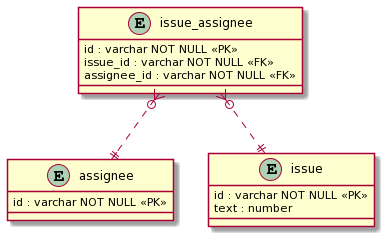

## 課題１

### クエリの実行結果

**NULL = 0, NULL = NULL, NULL <> NULL**

- NULL

NULL に関する算術比較演算子は、結果も全て NULL になるため、上記の比較から意味のある結果を得ることは出来ない。[参考](https://dev.mysql.com/doc/refman/5.6/ja/working-with-null.html)

実際に手元で試してみた

```sql
mysql> SELECT NULL = 0, NULL = NULL, NULL <> NULL;
+----------+-------------+--------------+
| NULL = 0 | NULL = NULL | NULL <> NULL |
+----------+-------------+--------------+
|     NULL |        NULL |         NULL |
+----------+-------------+--------------+
```

全ての結果が NULL になっている。つまり、比較出来ていないことが分かる。  
※ NULL-safe `<=>`等価比較演算子の場合を除いて、一方または両方の引数が NULL の場合は、比較の結果も NULL になります。

参考：https://dev.mysql.com/doc/refman/5.6/ja/type-conversion.html

**NULL AND TRUE**

- NULL

1 つ以上のオペランド(比較する変数)が 0 の場合は 0 に評価され、それ以外の場合は NULL が返される。

手元で試してみた

```sql
mysql> SELECT NULL AND TRUE;
+---------------+
| NULL AND TRUE |
+---------------+
|          NULL |
+---------------+
```

参考：https://dev.mysql.com/doc/refman/5.6/ja/logical-operators.html#operator_and

**NULL AND FALSE**

- 0(false)

片方が偽なら式全体として偽が確定するので、NULL AND FALSE は false

手元で試してみた

```sql
mysql> SELECT NULL AND FALSE;
+----------------+
| NULL AND FALSE |
+----------------+
|              0 |
+----------------+
```

参考：https://yoku0825.blogspot.com/2019/11/mysqlnull.html

**NULL OR TRUE**

- 1(false)

片方が真なら式全体としての真が確定するので、NULL OR TRUE は true

手元で試してみた

```sql
mysql> SELECT NULL OR TRUE;
+--------------+
| NULL OR TRUE |
+--------------+
|            1 |
+--------------+
```

参考：https://dev.mysql.com/doc/refman/5.6/ja/logical-operators.html#operator_or

## 課題２

**回答**
assignee と issue のリレーションを管理する中間テーブルを作成し、多対多の関係を作ることで issue テーブルに NULL を含まないようにすることが出来る。

中間テーブル(issue_assignee テーブル)を用いて、改善を行ったテーブル設計の ER 図(IE 記法)



テーブル定義

```text
TABLE assignee {
  id: varchar NOT NULL
}

TABLE issue {
  id: varchar NOT NULL
  text: varchar NOT NULL
}

TABLE issue_assignee {
  id: varchar NOT NULL
  issue_id: varchar NOT NULL
  assignee_id: varchar NOT NULL
}
```

issue は assignee が割り当てられていない状態で作成可能なため、リレーションの関係は以下のようになる。

assignee 対 issue_assignee = 1 対 0 か多  
issue 対 issue_assignee = 1 対 0 か多

参考：
https://qiita.com/ramuneru/items/32fbf3032b625f71b69d  
https://it-koala.com/entity-relationship-diagram-1897

### メモ

- ER 図を書く時におすすめのツールはあるのか？
  - PlantUML or Draw.io をよく使っているがその他
- NULL を取り除くために、中間テーブルを用意する手法はよくやるのだろうか？
  - 今回の例(Github)だと、アプリケーションの仕様は issue に対して assignee は常に一人であるはずだが、中間テーブルが出来たことによってアプリケーション側で複数人紐付けないように管理する必要が出てしまった。
  - 今回の課題(NULL を無くす)目的は？
    - NULL を無くすことで、assignee に紐付く issue を絞り込む際にインデックスを有効に使える？
    - issue_assignee の最新のデータを取得するようにすれば、issue に過去アサインされた assignee を追うことが出来るようになる？(イミュータブルなデータ設計)

## 課題３

### ※課題は全て MySQL を使用することとします。

No.1

あるインデックスが貼られているカラム(値には NULL が含まれている)に対して、IS NULL による絞り込みを行った際にインデックスは使われますか？

<details><summary>回答</summary>

- 使われます。

[公式ドキュメント](https://dev.mysql.com/doc/refman/5.6/ja/index-btree-hash.html)にも IS NULL を使用した検索では、インデックスが使用されることが記載されています。

また、MySQL 5.6(innoDB)以降から、NULL 値を持つカラムにインデックスを追加出来るようになりました。[参考](https://dev.mysql.com/doc/refman/5.6/ja/create-index.html)

過去記事には、NULL にはインデックスが効かないなどの記述があったりするので、確認する際は注意が必要です。

</details>

No.2

ある日のテスト結果を保存した test テーブルがあります。d 君は体調が悪く、テストを欠席してしまいました。
今回のテストの平均点(d 君も含めた平均)を算出するクエリとその結果を教えてください。

```text
+------+------+-------+
| id   | name | score |
+------+------+-------+
|    1 | a    |    70 |
|    2 | b    |    77 |
|    3 | c    |    90 |
|    4 | d    |  NULL |
|    5 | e    |    68 |
+------+------+-------+
```

<details><summary>回答</summary>

**実行するクエリ**

```sql
SELECT AVG(IFNULL(score, 0)) AS 'AverageScore' FROM test;
```

**実行結果**

```text
+--------------+
| AverageScore |
+--------------+
|      61.0000 |
+--------------+
```

AVG 関数は NULL を除外して計算してしまうため、NULL を含めて計算したい場合は IFNULL 関数を使って、値が NULL の場合は 0 を返すようにしている。

参考：
https://dev.mysql.com/doc/refman/5.6/ja/control-flow-functions.html#function_ifnull

</details>

No.3

`NULL AND ''`の結果はどうなるでしょうか？

<details><summary>回答</summary>

- 0(false)になる。

手元で試した結果。

```sql
mysql> SELECT NULL AND '';
+-------------+
| NULL AND '' |
+-------------+
|           0 |
+-------------+
```

挙動がちょっと謎なので、メンターに質問したい。もしくは分かる方いたら教えてください...

[参考](https://dev.mysql.com/doc/refman/5.6/ja/logical-operators.html#operator_or)より

> MySQL では、ゼロ以外の任意の非 NULL 値が TRUE に評価されます。  
> AND、&&  
> 1 つ以上のオペランドが 0 の場合は 0 に評価され、それ以外の場合は NULL が返されます。

NULL を返すはずでは？？

</details>

### メモ 2

- b-tree インデックスでは、null の値はどうやって保持されているんだろう？ (保持する順番など)
