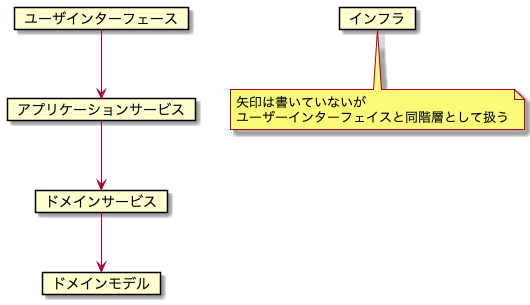

## 課題１

### オニオンアーキテクチャを図解してください

矢印の方向が依存の向きになります。

参考:
https://qiita.com/little_hand_s/items/2040fba15d90b93fc124#%E3%82%AA%E3%83%8B%E3%82%AA%E3%83%B3%E3%82%A2%E3%83%BC%E3%82%AD%E3%83%86%E3%82%AF%E3%83%81%E3%83%A3

**それぞれの説明**

- ドメインモデル

  - ドメインの問題を解決するためのモデル

- ドメインサービス

  - 集合に対する操作など、モデルをオブジェクトとして表現すると無理があるもの

    - 例: ユーザーの email 重複チェック処理をユーザークラスに記述するには違和感がある(ユーザーは他のユーザーの email を知らないはず)ので、ドメインサービスを使って表現する

- インフラ

  - DB や外部 API とのやりとりを行う

- ユーザインターフェース

  - アプリケーション外部(ユーザー側)との入出力を実現します。JSON でレスポンスを返したり、HTML をレンダリングして返したりする

### ドメインモデルが独立しているメリット

- どの層にも依存させないことで、ドメインモデルが変更しやすくなる

  - DB やフレームワークによる固有の実装を防ぐ

### 層をまたいだ依存はインターフェースのみ許可するメリット

- インターフェイスによって、具体的なクラスに依存することがなくなるため、変更しやすくなる

  - 同じような振る舞いが実装されたものを渡せば動くようになる

### 「依存性の逆転」の説明

- ドメインモデル(ドメインオブジェクト)とインフラ層の依存関係を逆転させることで、ドメインモデルを独立させた

### アクセス制御の実装場所

ユーザインターフェース層に記述する

理由: 権限がないのでリクエスト自体を拒否したい(入力のバリデーション)と考えたため、不正なリクエストがアプリケーション内部へ入り込み、内部で権限をチェックするのは違和感を感じる。また、複数のドメインモデルに権限という固有のルールに依存してしまうと考えた。

※ これはメンターに質問したい

### データベースを変更する場合、どの層を変更するか

- インフラ層の実装クラスを修正する
  - 他の層はインターフェイスのみに依存しているため、変更による影響を受けない

### 課題２

No.1

DDD を実装する際、クリーンアーキテクチャに比べて、オニオンアーキテクチャはどのようなメリットが考えられるでしょうか？

回答

- シンプルなので学習コストが低い
- レイヤーの責務の思想が DDD に近いため、理解しやすい
  - DDD のドメインオブジェクトは、オニオンアーキテクチャではドメインオブジェクトと表記されているが、クリーンアーキテクチャではエンティティと表記されている
    - DDD ではドメインオブジェクトの中でエンティティと値オブジェクトに分離されるため、混乱しやすい

参考: ドメイン駆動設計 モデリング/実装ガイド

No.2

オニオンアーキテクチャにおいて、ドメインモデルの生成や永続化の処理はどこの層で行うべきでしょうか？

回答

- アプリケーションサービス層(ユースケース層)

No.3

ドメインモデル内でリポジトリを用いて、DB へアクセスしても良いでしょうか？
ヒント: 書籍「ドメイン駆動設計 モデリング/実装ガイド」の第 6 章

回答

- 複数の責務を持つことになるので、非推奨

※ 基本的にリポジトリはアプリケーションサービス層でしか使われないのかな？質問したい

