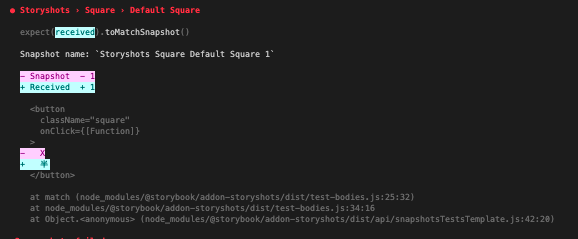

## 課題１（質問）

### スナップショットテストとはなんでしょうか？説明してください

- 単体テストのアサーションの一つで、UI が予期せず変更されていないかを確かめるのに非常に有効なテスト方法のことです。事前にコンポーネントを出力した時のスナップショットを作成しておき、テスト実行時にそのスナップショットと比較することで、今回の変更による差分を抽出し、差分があればテストが失敗するため、意図しないコンポーネントの変更を防ぐことが出来るようになります。

参考：https://jestjs.io/docs/ja/snapshot-testing

###　スナップショットテストを用いることで、どのような不具合が防止できるでしょうか？3 つほど例を挙げてみてください

- 頻繁に UI の変更が生じる時、各コンポーネントに意図していない変更を防止することが出来る。
- コンポーネントが複数の状態を持つ時、それぞれのパターンでテストを追加しておくことで、コンポーネントの変更によって状態変更時のコンポーネントにおいても意図していない変更を防止することが出来る。
- 実行時に再現が難しいコンポーネント(ある時間帯で値が変わるなど)のテストを追加しておくことで、再現が難しいコンポーネントの表示においても意図しない変更を防止することが出来る。また、自動テストとして実装しておくことで、再現のための負荷が減ります。
- コンポーネントをレンダリングしてスナップショットを作成するので、レンダリングエラーを検知することが出来る。

### スナップショットテストでは防止できない不具合もあります。3 つほど例を挙げてください

- スナップショットテストは、出力したコンポーネントをシリアライズした値を格納し比較するため、ビジュアルリグレッションテストのように、ブラウザに表示された UI を 1px 単位で比較するなどの細かな UI の表示状態をテストすることは出来ないため、表示崩れなどを防止することは出来ません。(CSS in JS のようにコンポーネントに CSS を含めることで、スナップショットテストでも CSS の変更を検知出来るようになりますが、実際に描写された際の表示のズレなどは確認することが出来ません。)
- スナップショットテストは、ある値で出力された結果を比較するだけなので、コンポーネントに設定した値やイベントが正しく動作するかをテストすることは出来ません。
- 関数単体での動作をテストすることは出来ないため、関数の意図していない変更による不具合を防止することは出来ません。

## 課題２（実装）

src/**snapshots**にスナップショットファイル`storyshots.test.ts.snap`が作成されました。
props を半に変えた時、スナップショットテストでエラーが発生することを確認しました。(以下の画像が実際に表示されたエラー)

また、スナップショットファイルを修正後テストが通ったことを確認しました。

## 課題３（クイズ）

no.1: `@storybook/addon-storyshots`を用いて、スナップショットファイルをストーリーファイル毎に分けるには、どのような設定を行えばいいでしょうか？
no.2: react で snapshot を導入する際によく導入されることが多い、`react-test-renderer`や`Enzyme`などのライブラリには shallow renderer という機能がありますが、通常のレンダリングとの違いは何でしょうか？
no.3: スナップショットファイルはコミットに含める必要があるでしょうか？
