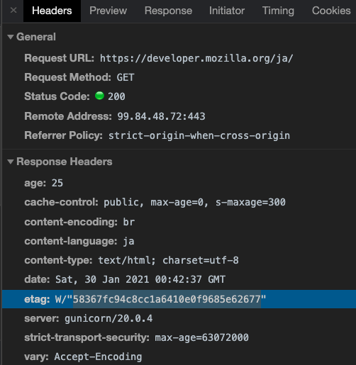
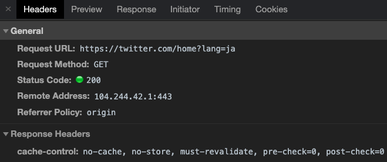
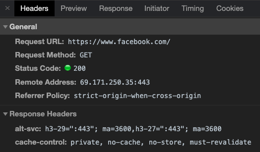
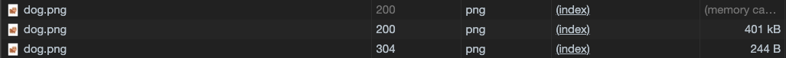
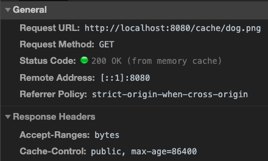
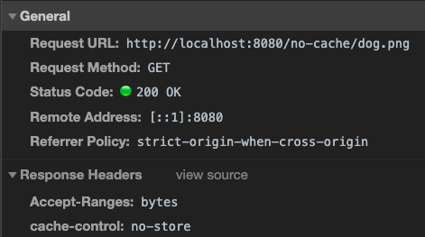
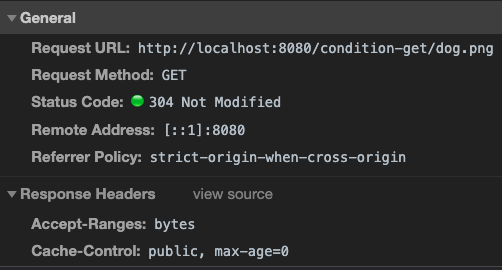

## 課題 1

### なぜキャッシュが必要なのか、説明してください

- そもそもキャッシュとは、ブラウザが表示した Web ページのリソースを使い回す仕組みのことです。キャッシュを用いることでサーバーとクライアント間、もしくは、サーバー間やサーバーとデータベース間で通信を行う際のネットワーク帯域の利用や処理時間を縮小し、より効率的に処理出来ることで、パフォーマンスの向上や負荷軽減に大きく役立ちます。近年、Web サービスはリッチ化の一途を辿っており、ページの表示に必要なデータの容量もメガバイト単位まで増加しています。どんなに回線が高速になったとしても、毎回通信を行ってデータを処理することは、それなりに時間が掛かってしまうため、キャッシュを用いて効率的にデータを処理することが必要になっています。

### キャッシュには様々な種類があります。いくつか例を挙げてそれぞれのキャッシュの違いを説明してください（「ブラウザキャッシュ」「プロキシキャッシュ」など）

- ブラウザキャッシュ
  ユーザー個別のブラウザ毎にリソースを保存する仕組みのことで、ユーザーが HTTP でダウンロードした全てのファイル(HTML、CSS、JS、img など)を保持します。サーバーと追加のやり取りを行う必要なしに戻る/進むの操作、ページの保存、ソースの表示などを可能にします。

  参考：https://developer.mozilla.org/ja/docs/Web/HTTP/Caching#private_browser_caches

- プロキシキャッシュ
  共有キャッシュと呼ばれ、複数のユーザーに再利用されるレスポンスを保存するキャッシュです。プロキシサーバーやキャッシュサーバーを用いて、ブラウザからのリクエストで得られたファイルをキャッシュしておき、同じ URL のリクエストが生じたときに本来の Web サーバーへファイルを取りにいかずにキャッシュした内容をブラウザに渡すものです。

  参考：
  https://developer.mozilla.org/ja/docs/Web/HTTP/Caching#shared_proxy_caches
  https://www.ipa.go.jp/security/awareness/vendor/programmingv2/contents/405.html

- アプリケーションによるキャッシュ
  アプリケーション内で特定の値やクエリ結果をキャッシュする仕組みのことで、Rails だとアクション単位やページの部分毎に細かくキャッシュを設定することが出来ます。(詳しくは、[Rails Guide](https://railsguides.jp/caching_with_rails.html))
  アプリケーションサーバーは、複数台で運用することが多いので、キャッシュしたデータを各アプリケーションで共有できるような仕組み(Redis や Memcached などのストレージ)を用意する必要があります。

  参考：
  https://qiita.com/inagakkie/items/f615d7d8cf172eb15a4b

### HTTP 通信における、ブラウザがキャッシュを制御するために存在するヘッダーを 3 つ以上挙げて、それぞれの役割を説明してください

- Pragma
  ヘッダーに設定できる値は`no-cache`のみ、リソースをキャッシュしてはならないことを示します。クライアントは毎回このリソースを取得する際には、必ずサーバーにアクセスしなければなりません。HTTTP/1.0 の時代に作られたヘッダーで、後の HTTP/1.1 では Cache-Control ヘッダーが作られ、同じ`no-cache`機能を持った上位互換のものとなっています。現在は非推奨のヘッダーとなっており、Pragma ヘッダーと Cache-Control ヘッダーを同時に設定した場合、Cache-Control ヘッダーが優先される。

  参考：https://triple-underscore.github.io/RFC7234-ja.html#section-5.4

- Expires
  キャッシュの有効期限を示すヘッダーです。リソースにアクセスする際にキャッシュが有効期限内かどうかによって、サーバーに再度アクセスするのか、キャッシュを利用するのかを決定します。有効期限は最大約 1 年後を設定することが仕様では推奨されています。

  (例)

  ```
  Expires: Thu, 01 Dec 1994 16:00:00 GMT
  ```

  参考：https://triple-underscore.github.io/RFC7234-ja.html#section-5.3

- Cache-Control
  Pragma ヘッダー、Expires ヘッダーでは、簡単なキャッシュはこれらで実現出来るのですが、複雑な指定は出来ません。より複雑な指定を可能にするため、HTTP/1.1 で Cache-Control ヘッダーが作られました。Expires ヘッダーでは絶対時間で有効期限を示しましたが、Cache-Control ヘッダーでは`max-age`を用いることで相対時間で有効時間を設定することが出来ます。

  (例)24 時間キャッシュが新鮮であることを示します

  ```
  Cache-Control: max-age; 86400
  ```

  参考：https://triple-underscore.github.io/RFC7234-ja.html#section-5.2

  #### 条件付きの GET

  クライアントが Expires や Cache-Control ヘッダーを検証した結果、ローカルキャッシュの有効期限が切れていた場合でも、条件付き GET を送信することでキャッシュを再利用することが出来るようになります。
  条件付き GET とは、サーバー側のあるリソースがクライアントのローカルのキャッシュから変更されているかを調べるヒントをリクエストヘッダーに含めることで、キャッシュがそのまま使えるかどうかを検証する仕組みです。
  条件付き GET は、そのリソースが Last-Modified ヘッダーもしくは ETag ヘッダーを持っている時に利用することが出来ます。

  - If-Modified-Since
    リソースの更新日時を条件にする際に使用するヘッダー

  ```
  GET /test HTTP/1.1
  Host: example.com
  If-Modified-Since: Thu, 11 May 2010 16:00:00 GMT
  ```

  サーバーのリソースが If-Modified-Since に設定されている日時以降変更されていなければ、サーバーは以下のようなレスポンスを返します。

  ```
  HTTP/1.1 304 Not Modified
  Content-Type: application/xhtml+xml; charset=utf-8
  Last-Modified: Thu, 11 May 2010 16:00:00 GMT
  ```

  Not Modified は、サーバー上のリソースが変更されていないことを知らせるステータスコードです。
  リソースの更新日時は Last-Modified ヘッダーで確認することが出来ます。
  このレスポンスはボディを含まないため、その分ネットワーク帯域を節約出来ます。

  - If-None-Match
    リソースの ETag を条件にするヘッダー
    時計を持っていないサーバーや m 秒単位で変更される可能性のあるリソースに対して、条件付き GET を行いたい時に使用されます。

  ```
  GET /test HTTP/1.1
  Host: example.com
  If-None-Match: ab3322028
  ```

  If-None-Match ヘッダーは「指定した値にマッチしていなければ」という条件になります。If-None-Match ヘッダーに指定する値は、キャッシュしてあるリソースの ETag ヘッダーの値になります。サーバー上のリソースが更新されていない場合、以下のようなレスポンスを返します。

  ```
  HTTP/1.1 304 Not Modified
  Content-Type: application/xhtml+xml; charset=utf-8
  ETag: ab3322028
  ```

  - ETag
    リソースの更新状態を比較する為だけに使用する文字列です。リソースを更新した際に別の値になるのであれば、どんな文字列でも問題ありません。

### ブラウザのキャッシュサイズの上限は、ユーザが自由に変更できます。最大容量はどの程度でしょうか？（ブラウザを複数調べて比較してみましょう）上限を超えると何が起きるでしょうか？

- Google Chrome
  デフォルトのキャッシュサイズが 300 ～ 320MB くらい
  [参考](https://rainxxrain.com/archives/373#:~:text=Google%20Chrome%E3%81%AE%E3%82%AD%E3%83%A3%E3%83%83%E3%82%B7%E3%83%A5%E3%82%B5%E3%82%A4%E3%82%BA%E3%81%AF%E3%80%81%E3%83%87%E3%83%95%E3%82%A9%E3%83%AB%E3%83%88%E3%81%A7300%EF%BD%9E,size%3D%E3%83%90%E3%82%A4%E3%83%88%E6%95%B0%E3%81%A7%E8%A8%AD%E5%AE%9A%E3%80%82)

  最大容量 2GB？起動時に使用可能なディスク容量の 10%？
  [参考](https://superuser.com/questions/378991/what-is-chrome-default-cache-size-limit)

  キャッシュがいっぱいになると上書きされる？
  [参考](https://superuser.com/questions/766866/in-which-scenarios-will-google-chrome-clear-its-cache-itself-not-by-user-reques)

- Safari
  デフォルトのキャッシュサイズも無制限？(キャッシュ削除方法が不明)
  [参考](https://www.stevesouders.com/blog/2010/04/26/call-to-improve-browser-caching/)

  無制限
  [参考](https://stackoverflow.com/questions/55963123/what-is-the-maximum-file-size-using-cache-api-on-mobile-browsers)

- Firefox
  デフォルトのキャッシュサイズが 50 MB
  [参考](https://www.stevesouders.com/blog/2010/04/26/call-to-improve-browser-caching/)

  version(60.0.1)では、最大値 1024 MB
  [参考](https://support.mozilla.org/en-US/questions/1219833)
  自動で削除されるように設定することが出来る(デフォルトの挙動は不明)

### あなたは、マイページ（ユーザの情報が動的に表示されるページ）の作成を任されました。マイページへのアクセスが多いことに気づいたあなたは、マイページをキャッシュしておくことを考えました。そこで「expires」ヘッダをレスポンスに含めることで、1 週間程度はキャッシュを使用するように設定しました。すると先輩エンジニアに「動的なサイトをキャッシュするなら、expires は使わない方が良いよ」と言われました。なぜでしょうか？どうすれば良いのでしょうか？

`expires`を用いた場合、設定した期間を過ぎるまでキャッシュされたリソースを返すようになってしまうため、期間内にリソースが更新されていても、そのリソースを使うことが出来なくなってしまいます。
そのため、動的なサイトのように指定した期間内に頻繁にリソースが変わる恐れがあるコンテンツには`expires`を用いるべきではありません。
動的なサイトをキャッシュする場合、Cache-Control ヘッダー`no-cache`を指定して毎回リソースの確認を行い、ETag ヘッダーを用いることでリソースが更新されていれば新しいリソースを返すようにすることで、動的なサイトでもリソースのキャッシュを有効活用することが出来るようになります。(※リソースの更新頻度によって、キャッシュする期間を調整しても問題ありません。)

参考：https://qiita.com/inagakkie/items/f615d7d8cf172eb15a4b

### ブラウザのキャッシュが WEB サービスに用いられている実例を、3 つ以上見つけて共有してください。どのような仕組みで対象がキャッシュされているのか、技術的な流れを説明してみてください。chrome の開発者コンソールの「ネットワーク」タブを使って探すのがオススメです

- [MDN](https://developer.mozilla.org/ja/)



スクリーンショットに載せている HTML を確認すると以下のようなレスポンスになっており、

```
cache-control: public, max-age=0, s-maxage=300 # s-maxageは共有キャッシュの有効期限を設定する
etag: W/"58367fc94c8cc1a6410e0f9685e627"
x-cache: Hit from cloudfront
```

HTML はブラウザでキャッシュせず、CloudFront 側で ETag を用いたキャッシュを行っていることが分かります。`immutable`属性も設定されているので、ユーザーがリロードしてリソース情報を再取得する際もローカルにリソースが flesh な状態でキャッシュされていた場合、ローカルのリソースを返すことが出来るようになっています。(※Google Chrome では、昔はリロードを行った際に`immutable`を指定していない場合、キャッシュの有効期限が切れていない時でもサーバーにリクエストを行う仕様になっていたみたいですが、現在はキャッシュされたリソースを使うようになっているみたいです。)

参考：
[immutable について](https://blog.jxck.io/entries/2016-07-12/cache-control-immutable.html#%E4%B8%8D%E5%BF%85%E8%A6%81%E3%81%AA-conditional-get)
[Chrome のリロードの仕様について](https://stackoverflow.com/questions/11245767/is-chrome-ignoring-cache-control-max-age)

CSS や画像は

```
cache-control: max-age=315360000, public, immutable
etag: W/"600135f2-80e"
x-cache: Hit from cloudfront
```

のようになっており、CloudFront とブラウザでキャッシュされていることが分かります。

- [Twitter](https://twitter.com/home?lang=ja)



スクリーンショットに載せている HTML を確認すると以下のようなレスポンスになっており、

```
cache-control: no-cache, no-store, must-revalidate, pre-check=0, post-check=0
```

キャッシュ防止の設定が入っていることが分かります。
(※[NDM](https://developer.mozilla.org/ja/docs/Web/HTTP/Headers/Cache-Control#preventing_caching) ではキャッシュ防止には`no-store`だけを使用してくださいと記載されており、Twitter の設定は悪い例のように書かれています。[IPA](https://www.ipa.go.jp/security/awareness/vendor/programmingv2/contents/405.html) の資料には、複数選択しても構わないと書いてあります。)

各コンポーネントで使用されていると予測される JS のレスポンスは以下のようなレスポンスになっており、

```
etag: "nzzXVFNxmk/Q8YsfYIB7ww=="
expires: Wed, 26 Jan 2022 05:12:47 GMT
last-modified: Sat, 23 Jan 2021 01:35:24 GMT
```

`ETag`と`last-modified`が設定されていることから`expires`の期限が切れると条件付きの GET(`If-None-Match`と`If-Modified-Since`)が行われることが分かります。

画像は以下のようなレスポンスになっており

```
cache-control: max-age=604800, must-revalidate
last-modified: Thu, 21 Jun 2018 15:18:06 GMT
```

キャッシュの期限が切れたら、必ずオリジンのサーバーへリソースの確認を行うようになっていることが分かります。

- [Facebook](https://www.facebook.com/)



スクリーンショットに載せている HTML を確認すると以下のようなレスポンスになっており

```
cache-control: private, no-cache, no-store, must-revalidate
expires: Sat, 01 Jan 2000 00:00:00 GMT
pragma: no-cache
```

`no-store`を指定していることから、twitter と同様にどのキャッシュにも保存しないようにしていることが分かります。`pragma`が残っているのは互換性担保？

JS と CSS のレスポンスは以下のようになっており

```
cache-control: public,max-age=31536000,immutable
expires: Sun, 30 Jan 2022 00:24:48 GMT
last-modified: Mon, 01 Jan 2001 08:00:00 GMT
```

`cache-control`の`max-age`と`expires`でキャッシュの有効期限を設定しており、リロード時にもローカルのキャッシュを使えるように`immutable`が指定してあることが分かります。

画像のレスポンスは以下のようになっており

```
cache-control: max-age=1209600, no-transform
last-modified: Tue, 24 Dec 2019 13:15:59 GMT
```

`max-age`を用いてキャッシュの有効期限を設定しており、`no-transform`を用いることで画像の圧縮を防いでいることが分かります。

## 課題２（実装）

http-cache-sample-app にアプリケーションを実装しました。
1 日キャッシュする画像、キャッシュしない画像(`no-store`)、条件付き Get を行う画像を配信するエンドポイントを用意し、レスポンスの結果が以下の画像になります。


- 1 日キャッシュする画像



- キャッシュしない画像



- 条件付き Get を行う画像



## 課題３（成果物に関する質問）

ブラウザキャッシュを使うべきではないケースを３つ考えて、ペアと会話してみてください。どんなサービスの？どんなページで？どんなファイルを？キャッシュしてはいけないのでしょうか？

- リアルタイムに動的なコンテンツを取り扱うページやコンテンツ
  ブラウザのキャッシュは、各ユーザー側にキャッシュがあるため、コントロールが聞きにくいので頻繁にキャッシュするリソースが変わるページやコンテンツではブラウザのキャッシュを有効活用することが出来ません。

  参考：https://qiita.com/inagakkie/items/f615d7d8cf172eb15a4b#%E3%82%B3%E3%83%B3%E3%83%86%E3%83%B3%E3%83%84%E3%82%AD%E3%83%A3%E3%83%83%E3%82%B7%E3%83%A5%E6%88%A6%E7%95%A5

- 大量の画像などのコンテンツを扱い、且つユーザーが複数ページを回遊するようなサービス(ニュースメディアとか？)
  ブラウザがキャッシュ出来るコンテンツの量は限度があります。静的コンテンツが大量にあり、且つユーザーが複数ページを回遊した場合、ブラウザのキャッシュが削除されてしまう可能性があるため、キャッシュを有効活用することが出来ません。逆に共有キャッシュであれば、有効活用出来そう？(メンターに聞いてみたい)

- 個人情報を取り扱うページやファイル(※ブラウザキャッシュで気を付ける例)
  ブラウザのキャッシュはブラウザを閉じたとしてもデータが残っていることがあるため、マルウェアへの感染や PC の盗難などによって、ブラウザに残っている個人情報を盗まれてしまう可能性があります。

  参考：https://www.lifehacker.jp/2013/06/130628caching.html

- 個人情報を取り扱うページやファイル(※ブラウザキャッシュではなく、共有キャッシュで気を付ける例)
  HTTP キャッシュの仕組みは非常に複雑で、ちょっとした設定ミスによって情報漏洩に繋がる恐れがあるため、個人情報などのセンシティブな情報をキャッシュするべきではありません。メルカリや SOD などの大きな会社でもキャッシュの設定ミスによるインシデントが発生しています。([メルカリ](https://engineering.mercari.com/blog/entry/2017-06-22-204500/)[SOD](https://scan.netsecurity.ne.jp/article/2020/03/31/43887.html))

## 課題４（クイズ）

No.1: Cache-Control ヘッダーの`no-cache`と`no-store`の違いを説明してください。
No.2: `ETag`と`last-modified`を指定したとき、どちらが優先されるでしょうか？
No.3: キャッシュ時間を設定する`Expires `,`s-maxage`, `max-age`の優先度を教えてください。
