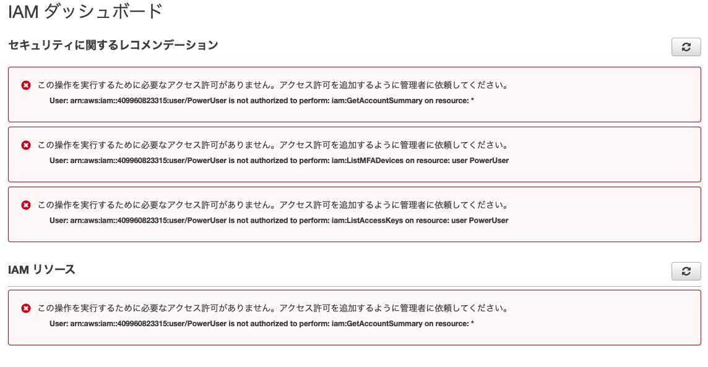

### 課題 1

**IAM ユーザ**

- AWS とやりとりを行うためのユーザーもしくはアプリケーションを表します。新規で作られる IAM ユーザーはデフォルトでは、AWS 上で何かを実行するためのアクセス権がが無いのでポリシーを設定する必要があります。

参考:  
https://docs.aws.amazon.com/ja_jp/IAM/latest/UserGuide/id_users.html

**グループ**

- IAM ユーザーの集まりです。グループを作ることで複数のユーザーに対するアクセス権の管理を容易に行うことが出来るようになります。例えば、新たに人が加わった際や組織内で担当業務が変わった際にユーザー個別にアクセス権を設定する必要が無く、作っておいたグループを設定することで対応することが出来ます。

参考:  
https://docs.aws.amazon.com/ja_jp/IAM/latest/UserGuide/id_groups.html

**ポリシー**

- アクセスを管理するするための仕組みです。IAM アイデンティティ (ユーザー、ユーザーのグループ、ロール) または AWS リソースにポリシーを関連付けることでアクセス許可を定義します。

参考:  
https://docs.aws.amazon.com/ja_jp/IAM/latest/UserGuide/access_policies.html

**ロール**

- 特定のアクセス権限を持ち、アカウントで作成できる IAM アイデンティティです。ユーザーは 1 人の特定の人に一意に関連付けられますが、ロールはそれを必要とする任意の人が引き受けるようになっています。また、ロールには標準の長期認証情報 (パスワードやアクセスキーなど) も関連付けられません。

参考:  
https://docs.aws.amazon.com/ja_jp/IAM/latest/UserGuide/id_roles_terms-and-concepts.html

### 課題２

**ユーザー**

- なぜ毎回ルートユーザとしてアクセスするのではなく、管理者権限の IAM ユーザでログインした方が良いのか？

  - ルートユーザーは権限が強力で何でも出来てしまい、悪用されるリスクがあるため(請求情報も見れてしまう)。

- PowerUserAccess ポリシーを付与した IAM ユーザはダッシュボードに何が表示されるか？

  - 画像のようにアクセス権が無いとエラーの表示が出るようになった。
  - 
  - IAM 以外の全てのリソースへアクセスすることが出来るポリシーらしい。[参考](https://docs.aws.amazon.com/ja_jp/IAM/latest/UserGuide/access_policies_job-functions.html)

**グループ**

- 直接ユーザに付与する方法とグループに付与してユーザを所属させる方法だと、どのような理由で、どちらの方が適切だと感じますか？

  - 基本的には以下の理由からグループに付与してユーザを所属させる方法が適切だと感じました。
    - グループ名によって複数のポリシーを名前付けして管理することが出来る。(Admin グループだったら IAM 周りがアクセス出来るかな？と名前で当たりが付く)
    - チームで AWS を運用する場合、ポリシーの管理が楽になったり、付け間違いのミスを減らすことが出来る。
      - ユーザー毎に毎回設定していると手動で設定している分ミスが発生する可能性が高まる。
      - グループを設定するだけで良いので、個別にポリシーを付けるよりも作業量を減らすことが出来る。

**サービスの IAM**

- EC2 インスタンスに SSH 接続して上記 S3 バケットの中身を一覧表示する aws cli コマンドを実行してください。

  - エラーではなくクレデンシャルが無くて弾かれたが、問題ない...？`Unable to locate credentials. You can configure credentials by running "aws configure".`

- EC2 から S3 へのアクセスしてみよう

参考:  
https://aws.amazon.com/jp/premiumsupport/knowledge-center/ec2-instance-access-s3-bucket/  
https://agohack.com/access-to-aws-s3-using-iam-roles/  
https://www.jpcyber.com/support/minimal-iam-policy-to-access-amazon-s3

- EC2 インスタンスにロールを付与するべきか直接ポリシーを付与するべきか、どちらの方が適切だと感じますか？

  - ロールを付与するべきだと思いました。
    - ロール名によって複数のポリシーを名前付けして管理することが出来るため。
    - 個別に設定すると管理が出来なくなるため。
    - 質問の意図が少し分からなかった。
      - EC2 インスタンスに直接ポリシーを設定出来る画面が見当たらなかったため。

### 課題 3

no.1：AWS 管理者は IAM でユーザを作成しました。作成されたユーザで AWS マネージメントコンソールにログインしたところ、ユーザはどの AWS サービスにもアクセスできませんでした。考えられる原因と対応は何でしょうか？

回答

- 原因

  - IAM ユーザーはデフォルトでは、AWS 上で何かを実行するためのアクセス権がが無いため。

- 対策

  - ロールやポリシーを割り当てる。

参考:  
https://docs.aws.amazon.com/ja_jp/IAM/latest/UserGuide/id_users.html

no.2：Amazon EC2 インスタンスから AWS の他のサービスにアクセスするためには認証情報が必要です。IAM ユーザー・IAM ロールのどちらの認証を使用した方が良いでしょうか？

回答

- IAM ロール

  - IAM ユーザーの場合、自身が持っている永続的な自身の認証情報を直接 EC2 に管理させる必要がある。
  - IAM ロールの場合、直接認証情報を EC2 に設定する必要がなく、一時的な認証情報を動的に提供し、自動的に更新してくれるため。

参考:  
https://docs.aws.amazon.com/ja_jp/IAM/latest/UserGuide/best-practices.html

