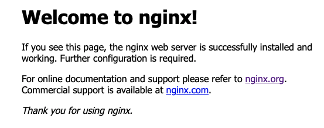

- プラベートサブネットに EC2 を作成すると書いてあるが、パブリックサブネットでは...?

## Nginx を導入する

apt-key がないと怒られた

```shell
$ cat /etc/os-release
NAME="Amazon Linux"
VERSION="2"
ID="amzn"
ID_LIKE="centos rhel fedora"
VERSION_ID="2"
PRETTY_NAME="Amazon Linux 2"
ANSI_COLOR="0;33"
CPE_NAME="cpe:2.3:o:amazon:amazon_linux:2"
HOME_URL="https://amazonlinux.com/"
```

CentOS だからっぽい
公式に Amazon Linux の Installation 書いてあった
http://nginx.org/en/linux_packages.html

Nginx はとりあえず安定版を入れた

```
[nginx-stable]
name=nginx stable repo
baseurl=http://nginx.org/packages/amzn2/$releasever/$basearch/
gpgcheck=1
enabled=1
gpgkey=https://nginx.org/keys/nginx_signing.key
module_hotfixes=true
```

公式を見ながら Install 後、Nginx を立ち上げてみる

```shell
$ systemctl start nginx
```

ブラウザからアクセスしてみる。良さそう


[ここ](https://www.nginx.com/blog/setting-up-nginx/#web-server)を参考に html を返すようにした

- いずれかのパブリックサブネットに ALB（アプリケーションロードバランサー）を設置してと書いてあるが、ALB は VPC に設定する感じじゃないのかな？？

### 参考

https://www.nginx.com/blog/setting-up-nginx/  
https://webplus8.com/aws-amazon-linux-os-version/  
https://weblabo.oscasierra.net/nginx-centos7-install/

### メモ

- ALB のヘルスチェックはどんな観点を基準に設定したらいいんだろう？
