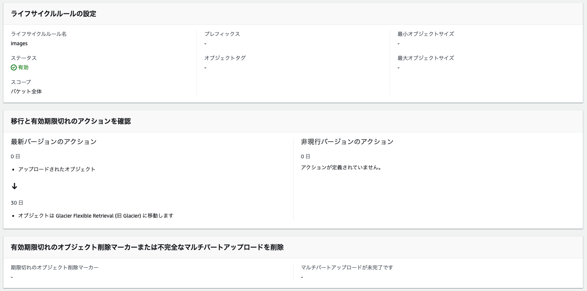
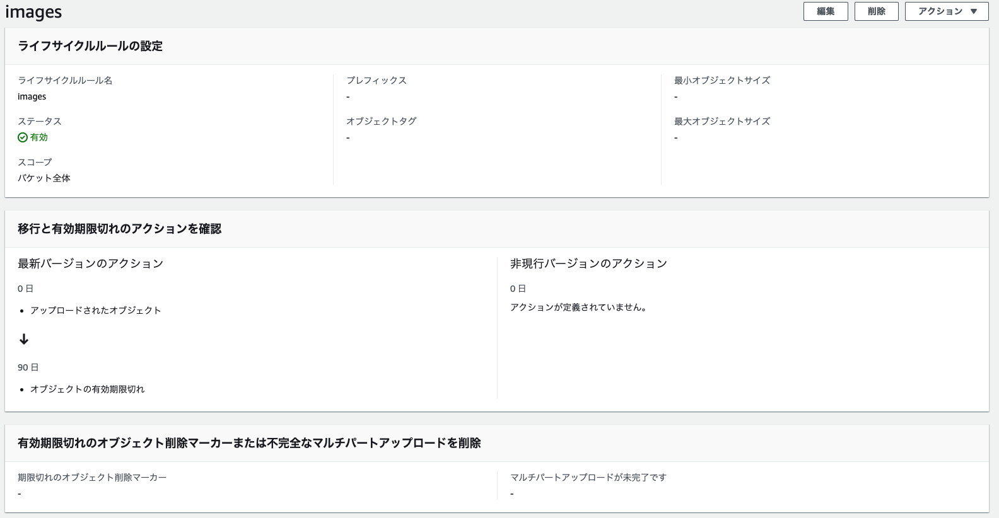
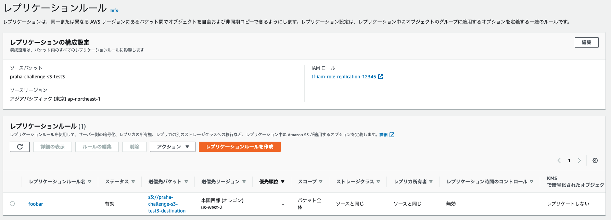
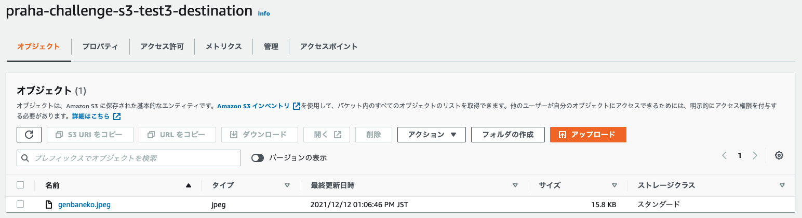
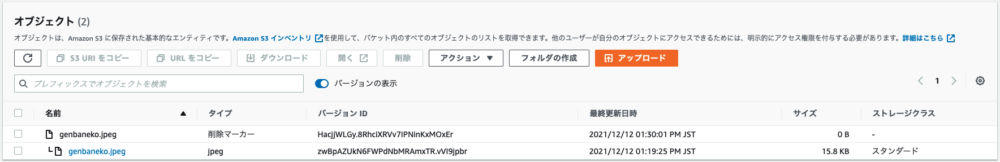
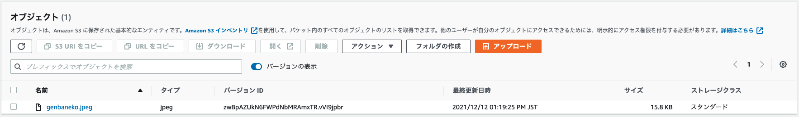

## 課題１（ストレージクラス）

### どのような時に、どのストレージクラスを選択するべきでしょうか？

- ストレージクラスを使用する目的

  - ユースケースに応じて、ランニングコストを下げるため

- ストレージクラスは以下の 6 種類が存在する

  - S3 Standard

    - 頻繁にアクセスされるデータ向け
    - ユースケース: 動的なウェブサイト、コンテンツ配信、モバイルやゲームのアプリケーション、ビッグデータ分析など

  - S3 Standard-IA

    - アクセス頻度は低いが、必要に応じてすぐに取り出すことが必要なデータ向け
    - ユースケース: データのバックアップなど
    - S3 Standard と比べると、データ保存の料金は安くなるが、30 日間以内にデータを削除したり、GB 単位の取り出しに料金が掛かることが特徴

  - S3 Intelligent-Tiering

    - アクセスパターンが変化、または不明な存続期間が長いデータ向け
    - ユースケース: アクセスパターンが予測できないコンテンツ配信など
    - 30 日間連続してアクセスされなかったオブジェクトは低頻度アクセス階層に移動する

  - S3 One Zone-IA

    - 存続期間が長くあまり頻繁にアクセスされない、且つ重要度の低いデータ向け
    - ユースケース: 使い捨てのサンプルアプリで使用するコンテンツとか？安くコンテンツを利用したい場合など
      - 通常の業務で使用したいユースケースはどんなのがあるだろう？一時的なデータのバックアップ置き場とか？

  - S3 Glacier

    - 取得時間が数分から数時間許容される長期アーカイブデータ向け
    - ユースケース: 長期アーカイブ(緊急性の高いアクセスあり)

  - S3 Glacier Deep Archive

    - 取得時間が 12 時間許容される長期アーカイブデータ向け
    - ユースケース: 長期アーカイブ(緊急性の高いアクセスなし)

### ほとんどアクセスされないバケットを作成する場合

- ほとんど・・・たまにアクセスがある場合

  - 重要なデータの場合
    - Standard-IA
  - 重要ではないデータの場合
    - S3 One Zone-IA

- 全くデータのアクセスがない場合

  - データをすぐに取り出す可能性がある場合
    - S3 Glacier
  - データをすぐに取り出す可能性がない場合
    - S3 Glacier Deep Archive

参考:  
https://techblog.forgevision.com/entry/2019/02/27/094449  
https://dev.classmethod.jp/articles/should_i_choice_s3_storage_class/  
https://aws.amazon.com/jp/s3/storage-classes/

### ライフサイクルとは

- オブジェクトをコスト効率の高い方法で保存されるように管理する方法のこと。オブジェクトのグループに対して、移行アクション・失効アクションを設定することができる
  - 移行アクション
    - 期限を設定して、別の S3 のストレージクラスにオブジェクトを移動することができる
    - ライフサイクル移行リクエストには関連コストが発生する
  - 失効アクション
    - オブジェクトの有効期限を設定することができる
    - 有効期限切れのオブジェクトは自動的に削除される

参考:  
https://docs.aws.amazon.com/ja_jp/AmazonS3/latest/userguide/object-lifecycle-mgmt.html

### 30 日経ったら、もっと安いストレージクラスに移動する

- terraform/aws_s3.tf の`s3_test1`を参照
- 設定できた
- 

### 90 日経ったら削除する

- terraform/aws_s3.tf の`s3_test2`を参照
- 設定できた
- 

## 課題２（バックアップ）

### 「バージョニング」と「レプリケーション」の違い

- バージョニング

  - 同じバケット内でオブジェクトの複数のバリアントを保持する手段のこと
  - バケットに保存されたすべてのオブジェクトのすべてのバージョンを、保存、取得、復元することができます
    - 誤ってオブジェクトを削除してしまった際に、削除前のバージョンに戻すことでオブジェクトを復元することができる
  - 無効、有効、停止のステータスがあり、一度有効にすると停止することしかできなくなる
    - 有効にした間に作成されたバージョニングを保持するため？

- レプリケーション

  - バケット間でオブジェクトを自動で非同期的にコピーする手段のこと
  - 同じ AWS アカウント が所有することも、異なるアカウントが所有することもできます

- 2 つの違い
  - バージョニングは同一バケット内でのオブジェクトの可用性を高める方法で、レプリケーションは複数バケットで可用性を高める方法
    - レプリケーションはコンプライアンス要件として利用される

### レプリケーション

- terraform/aws_s3.tf の`s3_test3`を参照
- 設定できた
- 
- レプリケーション先にも自動で移動されている
- 

### バージョニング

- terraform/aws_s3.tf の`s3_test3`を参照
- 画像を削除し、バージョンの表示をするとバージョニングされていることが分かる
- 
- 削除マーカーが付いている画像を「完全に削除する」と画像が復元される
- 

参考:
https://techblog.szksh.cloud/terraform-getting-started/  
https://dev.classmethod.jp/articles/3minutes-s3-versioning-lifecycle/  
https://docs.aws.amazon.com/ja_jp/AmazonS3/latest/userguide/Versioning.html  
https://docs.aws.amazon.com/ja_jp/AmazonS3/latest/userguide/replication.html
