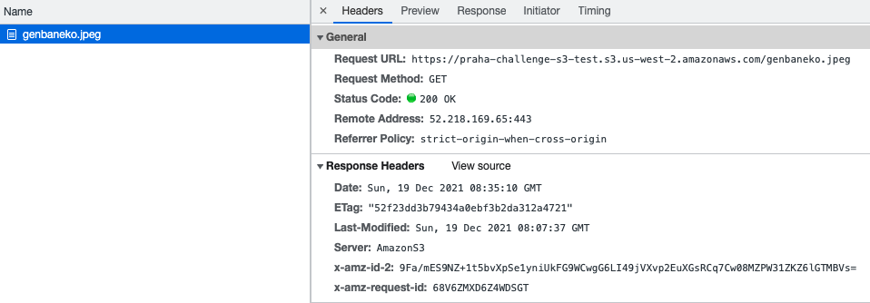
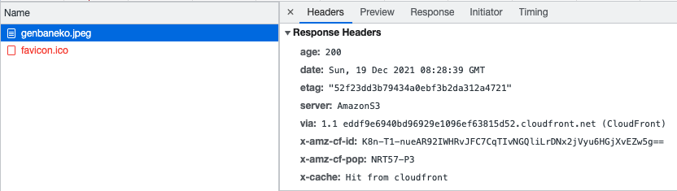

## 課題１

### CDNを使うと負荷分散やパフォーマンス改善につながる理由

- 距離の短縮
  - CDNサーバーは全世界のトラフィックの多い地域や戦略的な場所にあるデータセンターにサーバーを配置されているため、クライアントと要求されたデータの物理的な距離を短縮することができる
- リクエストの負荷分散
  - 各CDNサーバでコンテンツをキャッシュすることで、コンテンツの配信をCDNサーバが担うことになり、オリジンサーバへのリクエストの集中を減らすことができる
  - 動的コンテンツを利用したサイトでは、リクエストが来るたびにデータ処理をする必要あるため、その分サーバに負荷が掛かる。CDNサーバにコンテンツをキャッシュしておくことで、データを処理するためのサーバ負荷を減らすことができる(キャッシュして問題ないコンテンツなのかどうかは注意する必要あり)

参考:
https://www.cloudflare.com/ja-jp/learning/cdn/performance/  
https://www.p.uliza.jp/2018/12/19/what-is-cdn/  

### オリジンサーバとエッジサーバの違い
- オリジンサーバ
  - オリジナルのコンテンツを保持しているサーバ

- エッジサーバ(CDN)
  - クライアントに近いサーバ
  - 世界中にサーバが設置されている場合がほとんどなので、ユーザーが国外移動等した場合にも安定してスムーズなコンテンツ閲覧が可能といったメリットがある

### ブラウザキャッシュと比較したときの利点
- 複数のユーザーが共通して使用するコンテンツをキャッシュすることができる
- キャッシュするコンテンツをコントロールできる
  - ブラウザキャッシュでは、ブラウザやユーザー側にコントロール権がある
- CDNによっては、リクエストしたユーザー情報に応じて、コンテンツの最適化(画像のリサイズなど)をおこなってくれる

### ブラウザキャッシュよりCDNを使った方がよいのは？
- 複数人に共通の画像などのコンテンツを大量に扱うようなサービス
  - ニュースメディアとか、ブログなど
- 動画配信やライブ配信サービス
  - 大量のコンテンツをリアルタイムに各地のユーザーへ低遅延で届けることができる
  - https://www.cloudflare.com/ja-jp/products/cloudflare-stream/

## 課題２

`terraform`以下に設定値を記載
`us-east-2`にバケットを作成した

### s3のバケットのURLを直接叩いた際のレスポンス
- レスポンス速度は `120ms ~ 130ms`辺りだった
- 

- CloudFrontから配信され、cacheがhitしていることが分かる
- 

### CloudFront経由で画像を取得した際のレスポンス

- レスポンス速度は `8ms ~ 18ms`辺りになった
- 

- CloudFrontから配信され、cacheがhitしていることが分かる
- 

- `cache-control: max-age=0`で設定してしまったので、時間を伸ばせばもっと高速化できるかも？