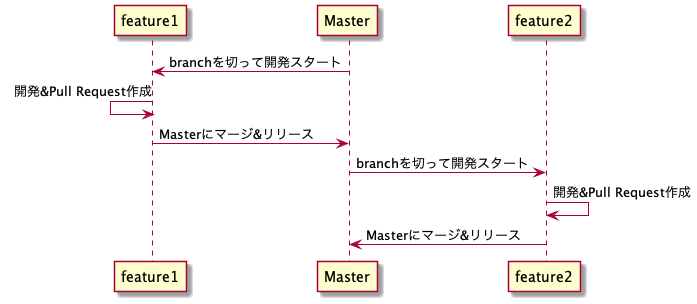
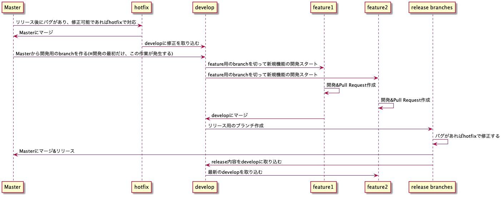

# 課題１（質問）

**GitHub Flow**

- 新規機能を開発する場合、常に master から 新しい branch を切って作業する方法
  - master にマージされたらリリースされる
  - master ブランチ と feature ブランチしか使わない

**Git flow**

- develop
  - 開発作業用のブランチ
  - 新しい機能は feature ブランチを作成して開発する
- feature
  - 新しい機能を開発するブランチ
    - develop ブランチを元に作成される
  - 開発が終わったら develop ブランチにマージする
- release
  - develop ブランチを基盤に作成されるブランチ
  - リリース直前にバグ修正などの微調整、つまり QA を行うブランチ
  - QA を完了したら、master, develop にマージ
- hotfix
  - リリースされたバージョンで発生したバグを速やかに修正するブランチ
  - master と develop にそれぞれ取り込む

参考:  
https://atmarkit.itmedia.co.jp/ait/articles/1708/01/news015.html#02  
https://nvie.com/posts/a-successful-git-branching-model/  
https://dev.classmethod.jp/articles/introduce-git-flow/

### メリット/デメリット

**Git flow のメリット/デメリット**

- メリット

  - 各ブランチの目的を明確にしながら、ソースコードを管理することができる
    - リリースしたい内容のコードをクリーンに保つことができる
    - リリース内容をまとめやすくなる
  - リリース前の動作確認環境ができるので、QA がしやすくなる

- デメリット

  - 作業フローが複雑
    - hotfix や feature 取り込み後の develop ブランチを最新にし忘れてコンフリクトが発生したりする恐れがある
  - リリースまで時間が掛かる
    - 気軽にリリースできないため、不確実性の高いものを開発することができない

- 大規模な開発やアプリや OSS など、リリース日が決まっていたり、ロードマップが決まっている場合や、入念に品質を確認しながら開発する場合に向いていそう
  - OSS はサポートするバーションによって、異なるコード状態にしておきたいので相性が良さそう

**GitHub flow のメリット/デメリット**

- メリット

  - 開発がシンプルになる
  - アジリティが高くなる
    - 開発した機能をリリース → 検証 → 改善のサイクルを早くすることができる
    - デプロイ頻度は企業の競争優位性に大きく関わる
  - feature 毎にマージされるので、原因を特性しやすくロールバックがしやすい

- デメリット

  - リリース前の検証環境がないので、動作確認漏れが起こる可能性がある
    - local では問題なかった、はよくあることなので本番と同様の環境で動作確認したい
    - feature 毎に環境を作るのはコストと時間がかかる
      - Heroku の[Review apps](https://devcenter.heroku.com/ja/articles/github-integration-review-apps)を使えば解決しそう
      - 複数の feature が走っていた場合、いちいち動作確認で環境を切り替えるのが面倒
  - いくつかの PR をまとめてリリースすることがやり辛い
    - リリースノートとかバージョンのタグ付けとか

- C 向けのサービスに向いていそう
  - もしくはプロダクトの開発初期など、速度重視の場合は向いていそう

### memo

- Gitlab flow というものもある
  - https://docs.gitlab.com/ee/topics/gitlab_flow.html
    - [翻訳](https://postd.cc/gitlab-flow/)
  - https://gist.github.com/taross-f/6c486940c831cd84bc45
  - Git flow と GitHub flow の中間を取ったようなもの
  - develop → staging → production に Pull Request を作成・マージしていくことでデプロイを進めることができる
    - 作業の流れが一方通行なので、理解しやすい
    - リリースをまとめることができる
  - 自分の今いる環境は Gitlab flow
