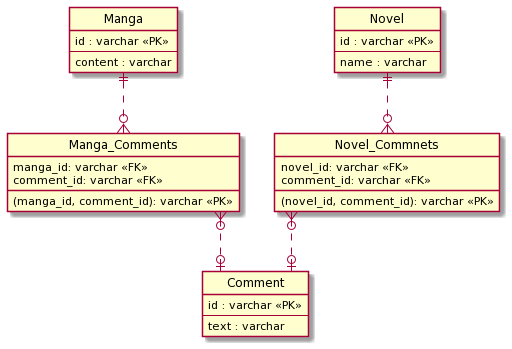

## 課題１

**ポリモーフィック関連(SQL アンチパターンより)**

**問題点**

- belongs_to_id カラムを見ただけでは、Manga テーブルの id か Novel テーブルの id かが分からない。
- 複数テーブルとの関連付けのため、外部キー制約を貼ることが出来ず、参照整合性を担保することが出来ない。
- Manga テーブル・Novel テーブルそれぞれに存在する id を belongs_to_id カラムに保存してしまった場合、正しいデータを取得することが出来なくなる。
  - ポリモーフィック関連を使って、Comment テーブルにメタ情報を保存するカラムを追加する(例: type カラムを追加して`Manga` or `Novel`を格納する)ことで、この問題を対応することが出来るが、外部キー制約が貼れないこととメタ情報を保存するカラムに対しても制約を付けることでテーブルの仕様が複雑化するという問題は残ってしまう。

## 課題２

新たに Manga と Comment の交差テーブル(Manga_Comments)と Novel と Commnets の交差テーブル(Novel_comments)を作ることで、問題点を解決することが出来る

```sql
TABLE Manga {
  id: varchar
  name: varchar
}

TABLE Manga_Comments {
  (manga_id, comment_id): varchar PK
  manga_id: varchar FK
  comment_id: varchar FK
}

TABLE Comment {
  id: varchar
  text: varchar
}

TABLE Novel_Commnets {
  (novel_id, comment_id): varchar PK
  novel_id: varchar FK
  comment_id: varchar FK
}


TABLE Novel {
  id: varchar
  name: varchar
}
```

それぞれのテーブルのリレーションは以下です。

Manga ： Manga_Comments = 1 : 0 or 多  
Comment : Manga_Comments = 0 or 1 : 0 or 多

Novel ： Novel_Commnets = 1 : 0 or 多  
Comment : Novel_Commnets = 0 or 1 : 0 or 多



今回の改善によって、問題点で上げていた課題が解決出来るようになります。

- belongs_to_id カラムを見ただけでは、Manga テーブルの id か Novel テーブルの id かが分からない。
  -> それぞれの交差テーブルを使うことで、Manga テーブル・Novel テーブルに紐づくコメントを取得することが出来る。
- 複数テーブルとの関連付けのため、外部キー制約を貼ることが出来ず、参照整合性を担保することが出来ない。
  -> 交差テーブルを用いたことで、参照先のテーブルが 1 つになったので、外部キー制約を貼ることが出来る。
- Manga テーブル・Novel テーブルそれぞれに存在する id を belongs_to_id カラムに保存してしまった場合、正しいデータを取得することが出来なくなる。
  -> 外部キー制約によって、参照先のデータの整合性を守ることが出来るようになった。
