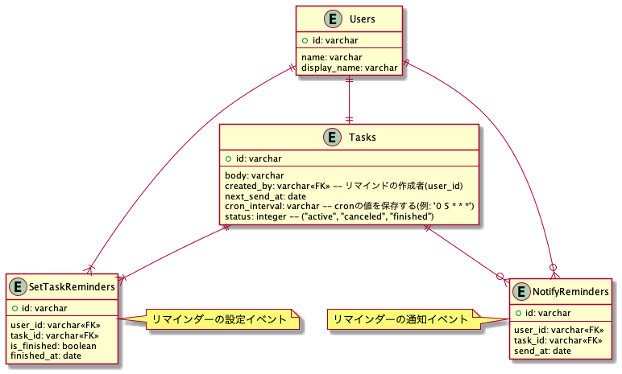

## 課題１

1. イベント系エンティティの抽出

「タスクのリマインダーを設定する(SetTaskReminders)」「リマインダーの通知(NotifyReminders)」

2. リソース系のエンティティの抽出

「ユーザー(Users)」 「タスク(Tasks)」

3. 各エンティティに必要な項目を追加

- SetTaskReminders

  - is_finished(完了したかどうか)
  - finished_at(完了日)

- NotifyReminders

  - send_at(通知を送った日)

- Users

  - name(名前)
  - display_name(slack のメンション用)

- Tasks

  - body(タスク内容)
  - created_by(作成者)
  - next_send_at(次回のリマインド時刻)
  - interval(リマインダーの周期)
  - status(ステータス)

4. 各エンティティのリレーション関係を設定
5. ユースケースに応じて、カラムを追加

**4・5 は一緒にやる**

- ユースケースを考える(https://penpen.netlify.app/ を参考にした)

  - ユーザー
    - タスクのリマインダーを設定する(複数可)
    - タスクのリマインダーの通知がくる
    - タスクを完了にする
    - タスクの完了通知をタスクを設定した人に送る
    - 自分が設定したタスク一覧を確認出来る
    - 自分宛のタスク一覧を確認出来る
  - タスク
    - 送信相手、文面、頻度を指定可能
    - 1 時間ごとにバッチが動き、配信が必要なリマインダーを指定されたユーザに配信する
    - リマインダーの周期
    - 設定可能な周期は、現時点では以下の 4 種類(「2 週間に 1 度」など、配信頻度のパターンは増えることが想定される)
      - 毎日
      - X 日おき
      - 毎週 X 曜日
      - 毎月 X 日

以下、テーブル定義書です。

```sql
TABLE SetTaskReminders {
  id: varchar
  user_id: varchar<<FK>>
  task_id: varchar<<FK>>
  is_finished: boolean
  finished_at: date
}

TABLE NotifyReminders {
  id: varchar
  user_id: varchar<<FK>>
  task_id: varchar<<FK>>
  send_at: date
}

TABLE Users {
  id: varchar
  name: varchar
  display_name: varchar
}

TABLE Tasks {
  id: varchar
  body: varchar
  created_by: varchar<<FK>> -- リマインドの作成者(user_id)
  next_send_at: date
  cron_interval: varchar -- cronの値を保存する(例: '0 5 * * *')
  status: integer -- active, canceled, finished
}
```

作成した ER 図はこちらです。



### 工夫した点

- Tasks テーブルが次にリマインドする時刻と通知する周期を保存するようにした
  - 次に通知するタスク一覧などを表示する要件が無かったので、次に通知する時刻`next_send_at`を毎回更新する設計にした
    - NotifyReminders テーブルに実際に通知した履歴が残るので、最悪そこから送信した日付を取り出せる
      - そもそも NotifyReminders テーブル要らなかったかも...？
        - 不具合調査はアプリケーションログで対応出来そう
        - 仮に送信出来ていなくても、そこまで問題ではない
  - 通知の周期の計算は Cron を用いることにした
    - 他に周期を柔軟に表現する方法が見つからなかった...。
    - Cron の値をカラムとして保持しておけば、そこから次回の時刻を計算出来る
      - ruby のライブラリだと https://github.com/siebertm/parse-cron
    - https://github.com/floraison/fugit#fugitnat を参考にすれば、「every 5 minutes」などの文字列を parse する時の参考になりそう。ライブラリを見る限り、隔週も対応出来ていそう。
  - 各ユーザーがタスクを完了する度に、タスク作成者に通知が行き、SetTaskReminders テーブルの`is_finished`が true になり、`finished_at`に値が入る
    - 全てのユーザーがタスクを完了したら、Task テーブルの`status`が`active`から`finished`になる
      - 1 時間毎にタスクを探す時は、`status = active` AND `next_send_at < 現在の時刻`に該当するタスクを実行する

### メモ

- リマインダーの情報を履歴として、残すのかどうかでテーブル設計が大きく変わりそう。

- 参考
  https://api.slack.com/methods/reminders.add
