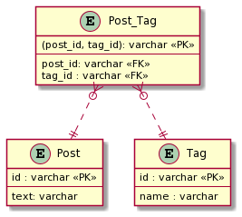

### 課題１

**問題点**

- 特定の tag を検索する際に、パターンマッチが必要になるため、インデックスを使えず、パフォーマンスに課題が出る可能性がある。
- 特定の tag を更新・削除する処理が複雑化する。
  - パターンマッチで一致するレコードを検索し、対象のレコードを抽出する必要がある。
- 不正な値が入る可能性が高くなる。
  - バリデーションを掛ける際、フォーマットの指定が複雑化してしまう。
- ひとつのカラムに複数の値が格納されているので、集約クエリを実行することが難しくなる。

### 課題２

新たに Tag テーブルに切り出し、Post と Tag の交差テーブル(post_tag)を作ることで、問題点を解決することが出来る

TABLE Post {
id: varchar PK
text: varchar
}

TABLE Tag {
id: varchar PK
name: varchar -- ("tagA,tagB,tagC"といった値が入る)
}

TABLE Post_Tag {
(post_id, tag_id): varchar PK
post_id: varchar FK
tag_id: varchar FK
}

それぞれのテーブルのリレーションは以下です。

Post ： Post_Tag = 1 : 0 or 多  
Tag : Post_Tag = 1 : 0 or 多

今回の改善によって、問題点で上げていた課題が解決出来るようになります。

- 特定の tag を検索する際に、パターンマッチが必要になる。
  -> Post_Tag から id の検索 or Tag テーブルの name から直接必要な Tag を検索出来るようになった。
- 特定の tag を更新・削除する処理が複雑化する。
  -> Tag テーブルから目的のレコードを直接更新・削除するだけで良くなった。
- 不正な値が入る可能性が高くなる。
  -> Tag テーブルに、1 データにつき 1 レコードが保存されるようになったので、バリデーションの処理がシンプルになった。
- ひとつのカラムに複数の値が格納されているので、集約クエリを実行することが難しくなる。
  -> Post_Tag テーブルを用いることで、ある Post に紐づく Tag の個数を計算したい時などに集約クエリを用いてシンプルに実装することが出来るようになった。
