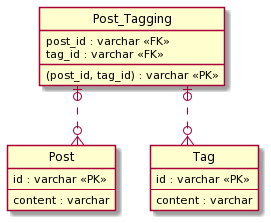

## 課題１

**マルチカラムアトリビュート(SQL アンチパターンより)**

**問題点**

- Post に紐づく Tag を検索する際に、3 つのカラム全てに検索をかける必要があるため、クエリが複雑化する。
  - 集約クエリを使って、Post に紐づく tag の数を取得する際など、処理が複雑化する。
- 値の追加・削除も複雑化する。
  - 追加の場合、対象のカラムが NULL かどうかチェックする必要がある。また、3 つのカラムが全て埋まっていた場合の処理も考える必要がある。
  - 削除の場合、削除対象が 3 つの内どのカラムに存在しているのか、チェックする必要がある。
- 各 tag カラムに入る値が一意であることを保証することが出来ない。
  - ta1, ta2, tag3 に同じ値を入れられてしまう恐れがあり、アプリケーション側で確認するロジックを追加する必要がある。
    - アプリケーションは変化しやすいので、RDB を用いるのであれば、DB 側でセーフティネット的な役割でデータの整合性を保てる方が良い。
- Post に付けられる Tag の数が増えた場合、既存の実装を踏襲すると tag4 カラムを追加する必要があり、それによって既存の処理の複数箇所を修正する必要が出てしまう。
  - 例: Post に紐づく Tag を検索する際に、対象のカラムに tag4 を追加する必要がある。

### メモ

- SQL アンチパターンでは、tag1, tag2, tag3 はそれぞれ意味が分けられて使われているのであれば、使用しても良いとのこと。
  - 例: tag1(created_by) = 作成者, tag2(read_by) = 閲覧者 (それぞれのカラムに意味を持たせるために、この設計を選んだ場合、括弧のカラム名に変える。)
    - それぞれの値は別の意味を持つようになるので、検索の際に各カラムに絞り込みを行っていた処理が要らなくなり、シンプルになる。
- 前回の課題と何が違うんだろう？
  - どちらも同じ属性の値を複数管理したい
    - 前回の課題: 1 カラムで対応する
    - 今回の課題: カラムを増やす
  - 単純に Post 対 Tag が　１対 多じゃ駄目な理由
    - Tag の使い回しが出来ない。同じ Tag を他の Post にも使いたい場合、交差テーブルを作る必要がある。

## 課題２

新たに Post と Tag の交差テーブル(Post_Tagging)を作ることで、問題点を解決することが出来る

```sql
TABLE Post {
  id: varchar
  content: varchar
}

TABLE Tag {
  id: varchar
  content: varchar
}

TABLE Post_Tagging {
  (post_id, tag_id): varchar PK
  post_id: varchar FK
  tag_id: varchar FK
}
```

それぞれのテーブルのリレーションは以下です。

Post ： Post_Tagging = 1 : 0 or 多  
Tag : Post_Tagging = 1 : 0 or 多



今回の改善によって、問題点で上げていた課題が解決出来るようになります。

- Post に紐づく Tag を検索する際に、3 つのカラム全てに検索をかける必要があるため、クエリが複雑化する。
  -> Post_Tagging テーブルを使用することで、検索が比較的シンプルになった。
- 値の追加・削除も複雑化する。
  -> 値の追加削除は Post_Tagging テーブルで簡潔するようになった。3 つしかタグを付けられないという制約は DB 側では満たせなくなったが、ドメインのルールだと思うのでアプリケーション側で制御するべき(?)
- 各 tag カラムに入る値が一意であることを保証することが出来ない。
  -> Post_Tagging の複合主キーが uniq 制約の役割を果たしてくれる。
- Post に付けられる Tag の数が増えた場合、既存の実装を踏襲すると tag4 カラムを追加する必要があり、それによって既存の処理の複数箇所を修正する必要が出てしまう。
  -> Post_Tagging を用いることで、Tag の追加に柔軟性を持たせることが出来るようになった。
